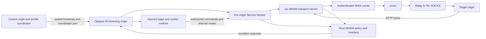

# ZeroProxy V2 Clean-Room Rewrite: Complete Agent Instructions

**Status:** Normative architecture, compiler, security, compatibility, performance, and delivery contract  
**Audience:** Architecture, browser-runtime, compiler, WASM, transport, relay, security, test, build, and release agents  
**Delivery model:** Zero-install hosted web application  
**Implementation model:** Injected browser runtime + Rust/WASM rewriter + client-side Go/WASM transport kernel  
**Language:** English only

---

## 0. How to Use This Document

This document is the sole implementation brief for a clean-room ZeroProxy V2. It must be sufficient to understand the product and implement it without treating the V1 code as the architecture.

V1 remains a read-only source of behavioral evidence, failure examples, and compatibility fixtures. Do not mechanically port its implementation. Preserve an observable contract only when this document names it.

The words **MUST**, **MUST NOT**, **REQUIRED**, **SHOULD**, **SHOULD NOT**, and **MAY** are normative in the RFC 2119 sense.

When requirements conflict, use this order:

1. No known direct target-network egress through the supported, enumerated, release-tested surface.
2. Target HTTPS is terminated and verified in client-side WASM, not at the relay/server.
3. Mutually distrustful target origins do not share one browser origin.
4. Original target source never executes after a required rewrite fails.
5. ECMAScript and Web Platform semantics are preserved before stealth or convenience.
6. Observable ZeroProxy artifacts are minimized under the bounded stealth oracle.
7. Performance, bounded memory, and maintainability.

An agent MUST write and obtain approval for an architecture decision record before weakening a higher-priority rule to satisfy a lower-priority rule.

---

## 1. Product Intent and Engineering Truth

### 1.1 Required product

ZeroProxy V2 MUST provide all of the following without a browser extension, native application, local proxy, VPN, installed CA, or modified browser:

- A user opens a hosted ZeroProxy URL in an ordinary supported browser.
- A user enters or shares an HTTP(S) target URL.
- Target documents execute in a real browser viewport and remain interactive.
- Target traffic follows this browser-owned privacy path:

```text
Per-origin Service Worker
  -> client-side Go WASM kernel
  -> authenticated WebSocket carrier
  -> smux
  -> SOCKS5 DOMAIN
  -> Tor/approved SOCKS
  -> uTLS
  -> target HTTP/1.1, HTTP/2, or WebSocket
```

- Rust/WASM rewrites HTML, JavaScript, CSS, import maps, URLs, and dynamic executable strings before browser execution.
- An injected runtime mediates dynamic DOM, navigation, realm, storage, cookie, messaging, and network surfaces.
- The target sees a target-like URL/origin/DOM/API surface rather than raw proxy routes and runtime artifacts.
- Unsupported or unclassified network/execution paths fail closed.

### 1.2 Selected architecture in one sentence

**ZeroProxy V2 assigns every virtual target origin a profile-keyed opaque-looking HTTPS tuple origin, runs a same-origin Service Worker and client-side WASM transport there, rewrites every executable and network-bearing boundary through a single policy/compiler contract, injects one atomic runtime membrane before target code, and sends all supported target transport through an authenticated content-blind relay and Tor while using native browser SOP between distinct synthetic origins.**



### 1.3 Hard guarantees versus bounded claims

The architecture MUST distinguish promises that can be proven from promises that cannot.

#### Hard, release-testable guarantees

Within the exact supported browser/version/policy matrix and enumerated egress surface:

- Unknown Service Worker requests fail closed.
- Every supported target HTTP(S)/WS(S) operation is mapped to a controlled internal route or message protocol.
- Container CSP has no wildcard target-network source and blocks missed passive/connect/worker/frame/form loads where CSP governs them.
- Original executable source never runs after parse, policy, compiler, or code-generation failure.
- Target TLS verification occurs in client-side Go/WASM with no certificate bypass.
- Relay access is authenticated, bounded, and production relay egress never falls back to direct dialing.
- Target cookies do not become browser cookies for the proxy site.
- Cross-target origins use different native tuple origins.
- Packet/DNS canaries record zero direct egress for every enumerated release test.
- Under the named oracle, no stable signal may be unowned or absent from the signed delta registry. Every known implementation identifier, backing marker, bootstrap artifact, internal route/runtime URL, helper binding, Service Worker signal, or Performance signal MUST be minimized, version-scoped, assigned an owner and expiry, and covered by a removal or non-regression test.

#### Bounded compatibility and anti-detection claims

The product MAY claim only:

> ZeroProxy minimizes observable mediation deltas. Within a named browser/version differential oracle, every known stable signal is owned and listed, and no unowned deterministic signal is accepted. It does not claim mathematical, universal, DevTools-level, or adversarial undetectability.

A hostile same-realm page can in principle inspect browser-owned `WindowProxy`/`Location` invariants, pristine cross-realm intrinsics, descriptors, object identity, source text, stack/source positions, parser/event order, MutationObserver delivery, Performance Timeline entries, CSP/SRI behavior, Service Worker state, and timing. A finite green corpus is not a proof that no distinguisher exists.

#### No-IP-leak qualification

A zero-install top-level web document has no browser-enforced general navigation allowlist. Its Service Worker cannot intercept a cross-origin top-level destination, and CSP sandbox permits a top-level document to navigate itself. Therefore the product MUST NOT claim a mathematical no-egress proof against arbitrary future browser features or an undiscovered self-navigation sink.

The defensible claim is:

> No direct target IP/DNS egress is known or observed through the complete, versioned, enumerated transport/navigation/execution matrix; every supported release is packet-capture tested, and unsupported surfaces are disabled or fail closed.

Any broader marketing statement is prohibited.

---

## 2. Why V1 Must Be Redesigned Rather Than Ported

### 2.1 Observed V1 topology

V1 currently uses one proxy origin and one root runtime illusion:

```text
control shell / one native proxy origin
  -> Service Worker
  -> Go WASM
  -> WebSocket/smux
  -> SOCKS5
  -> uTLS
```

Relevant boundaries:

- `web/`: control shell, Service Worker, injected page runtime, worker runtime.
- `rewriter-rs/`: Rust/WASM HTML, CSS, JavaScript, URL, share, and import-map logic.
- `cmd/wasm-kernel/`: Go/WASM transport, cookies, redirects, target TLS, HTML bridge, target WebSocket.
- `cmd/zeroproxy-server/`: asset server and unauthenticated WSS/smux relay.
- `internal/`: HTTP, SOCKS, cookies, TLS, headers, smux, WebSocket protocols.
- `test/`: JavaScript tests, one large Chromium E2E test, declarative matrices, and live corpus.

### 2.2 Root cause of current JavaScript branches

The V1 compiler lowers selected globals, aliases, members, calls, assignments, updates, constructors, reflection, every `in`, and many optional chains to a large `__zp_*` helper ABI. The runtime then manually approximates language and browser behavior.

Observed semantic risks include:

- non-callable selected methods returning `undefined` instead of throwing;
- wrong getter/RHS/setter order in compound assignment;
- incorrect `BigInt` update and `ToNumeric` behavior;
- strict failed sets not throwing;
- primitive right-hand `in` being boxed;
- optional call arguments evaluating before nullish short-circuit;
- broad `.constructor`, `.get`, `.open`, `.assign`, and computed-member matching on unrelated objects;
- flow-insensitive alias sets with incomplete propagation;
- indirect/aliased eval gaps;
- regex classic/module recovery and repeated full parsing;
- full-program minified regeneration, source geometry loss, and detectable function source.

V2 MUST reduce the compiler to rigorously specified boundary transforms. Ordinary JavaScript operations remain native syntax. Facade identity—not compiler taint propagation—carries behavior through aliases.

### 2.3 Current static/runtime drift

V1 independently implements policy in Rust, JavaScript, Go, and URL-building helpers. Observed drift includes:

- static `<base>` does not reliably affect later static URL resolution;
- script MIME parameters/legacy JavaScript MIME essences are incomplete;
- static and dynamic classic-script routes carry different referrer/charset context;
- URL resolution uses several independent algorithms;
- `srcset` uses duplicated non-WHATWG scanners;
- import-map scope/address processing is approximate;
- static and dynamic blob/data policies differ;
- malformed import maps, CSS, and scripts use inconsistent failure philosophies;
- preload/modulepreload/manifest/speculation behavior is blocked rather than safely proxied;
- static and runtime DOM transformation sequences diverge.

V2 MUST have one typed policy authority and one route serializer.

### 2.4 Current performance costs

Observed V1 costs include:

- full SWC parse/resolver/AST/codegen per script;
- parser retry amplification;
- synchronous dynamic-code rewriting;
- whole-body script/CSS buffering;
- per-16 KiB Go -> JS -> Rust -> JS -> Go HTML crossings;
- per-32 KiB Go -> JS response copies;
- a broad document MutationObserver and repeated parse/walk/serialize cycles;
- separate Rust instances in the Service Worker and each document;
- one monolithic Rust WASM containing unrelated HTML/CSS/JS/crypto code;
- fixed-name `no-store` internal assets and repeated WASM setup;
- custom API state machines rather than native gateways;
- unbounded or weakly bounded stream queues.

V2 MUST split artifacts, make byte ownership explicit, cache immutable assets, preserve source spans, eliminate retry parsing, narrow runtime hooks, and add real backpressure.

### 2.5 Current lifecycle/security gaps

Observed V1 risks include:

- all target sites share one native origin;
- Service Worker `skipWaiting()`/`clients.claim()` can invalidate in-memory state used by existing documents;
- routes, tabs, clients, cookies, uploads, streams, and transport state are largely volatile;
- history and frame assignment have stale-write races;
- wildcard passive CSP permits direct egress after a missed rewrite;
- reflected permissive CORS does not reproduce target CORS;
- internal APIs can become confused deputies if authorized by Referer/URL state;
- arbitrary relay fragments are a silent trust decision;
- the relay is unauthenticated and unbounded;
- production and direct-development relay modes are too close;
- WebSocket framing/backpressure/cancellation is incomplete.

V2 MUST fix these at ownership and protocol boundaries.

### 2.6 QuickJS

QuickJS is not part of the authoritative current source/build/runtime. Stale ignored `dist/` files do not define product behavior. V2 MUST NOT introduce QuickJS, Emscripten, a second JavaScript engine, or a virtual browser implemented inside WASM.

---

## 3. Architecture Decision Record: Browser Origin Model

### 3.1 Decision

Use one ordinary HTTPS tuple origin per virtual target origin and ZeroProxy profile:

```text
https://o-<origin-id>.browse.<deployment-domain>/
```

This is an opaque-looking hostname, not an HTML opaque origin.

The virtual target origin key is:

```text
canonical_origin = lower-case scheme + "://" + IDNA ASCII host + ":" + effective port
origin_id = base32(truncate160(HMAC-SHA256(profile_origin_key,
            "zeroproxy-origin-v2\0" || canonical_origin)))
```

The mapping includes scheme and port. `http://a`, `https://a`, and `https://a:8443` MUST map differently.

### 3.2 Why not one proxy origin

A single native origin forces JavaScript to emulate SOP for every frame, popup, storage object, message, WindowProxy, history transition, and worker. One raw-object escape grants authority over every target. This is the architectural source of the largest branch and security burden.

### 3.3 Why not real target origins

A hosted zero-install Service Worker/runtime cannot control or inject arbitrary real HTTPS target origins. Browser origin and TLS rules prohibit it. Real target origins require an installed extension/proxy/VPN or target cooperation, which violates the zero-install requirement.

### 3.4 Why not a framed target

A persistent control page with a sandboxed target iframe could provide a stronger top-navigation boundary, but it is directly detectable and breaks `top`, opener, focus, frame-ancestor policy, storage partitioning, OAuth/popups, downloads, fullscreen, and ordinary navigation. Target pages remain top-level.

### 3.5 Native benefits

Distinct synthetic origins provide browser-enforced:

- cross-origin DOM and WindowProxy restrictions;
- origin-keyed localStorage, IndexedDB, CacheStorage, locks, and worker identity;
- per-origin Service Worker registrations;
- same-origin frame/popup relationships when virtual origins match;
- real cross-origin navigation when virtual origins differ.

The runtime still translates target-visible URLs/origins and specific messaging/network semantics, but it no longer owns the entire cross-target security boundary.

### 3.6 Site-semantics limitation

All `*.browse.<deployment-domain>` hosts ordinarily share the same registrable proxy site. This does not reproduce virtual target schemeful-site relationships.

Consequences include differences in browser-owned:

- SameSite classification for native proxy cookies;
- `Sec-Fetch-Site` generated for proxy routes;
- storage/network partition keys;
- `document.domain` and same-site process grouping;
- some browser heuristics and policy behavior.

Rules:

- Browser proxy-site cookies MUST never represent target cookies.
- The coordinator's `cookie-core` authority MUST calculate target cookies and SameSite; Go/WASM MUST calculate or consume trusted credentials, Origin, Referer, and Fetch Metadata decisions from canonical virtual target context.
- Browser-generated proxy-site policy headers MUST be stripped before egress and replaced with target-context values.
- `Origin-Agent-Cluster: ?1` MUST be sent.
- `document.domain` MUST be blocked/virtualized and MUST never relax synthetic siblings.
- This native-site mismatch is a documented bounded compatibility/detection delta; a facade cannot make every browser-internal site decision native-equivalent.

### 3.7 Host and TLS requirements

- Wildcard DNS for exactly one origin-ID label is REQUIRED.
- TLS certificate coverage for `*.browse.<deployment-domain>` plus explicit control, asset, and relay hosts is REQUIRED.
- Every Host is classified before routing; arbitrary suffix matching is prohibited.
- HTTP redirects to HTTPS before any sensitive operation.
- HSTS `includeSubDomains` is enabled only when every named/wildcard role is TLS-ready.
- The server serves only bootstrap/internal assets/errors on browsing hosts; target retrieval remains browser-WASM-owned.
- The server cannot infer the target from `origin_id` without the profile key. It may link repeated opaque IDs within a profile/session.

### 3.8 Mapping and collision rules

The control coordinator keeps a bidirectional registry keyed by profile. Both canonical-origin and origin-ID uniqueness are enforced. A detected collision derives a new ID with a monotonically encoded collision counter in the HMAC input. No caller chooses its own origin ID. A bootstrap MUST verify that decrypted/sealed target origin maps to the current Host before target bytes execute.

### 3.9 Share and cross-origin handoff envelopes

Public share URL:

```text
https://<control-origin>/_zp/s/v2/<base64url(nonce || ciphertext || tag)>#k=<base64url(key)>
```

The canonical CBOR plaintext is:

```text
{
  v: 2,
  target_url: text,              // HTTP(S), no userinfo, <=8192 UTF-8 bytes
  created_at: uint,
  expires_at: uint | null,
  relay_profile_digest: bytes | null,
  requested_profile_mode: \"ephemeral\" | \"persistent\",
  flags: uint
}
```

Use a random 32-byte key, random 12-byte nonce, AES-256-GCM, and AAD `\"ZeroProxy Share V2\\0\" || canonical_control_origin`. Encoding is URL-safe base64 without padding; total share URL is capped at 16 KiB. The fragment key never enters an HTTP request, Referer, log, telemetry record, or target-visible API. Reject unknown versions, duplicate/noncanonical CBOR keys, malformed UTF-8, invalid tags, unsupported URLs, oversize values, expired links, and unapproved relay-profile references.

A profile-internal cross-origin handoff is distinct from a public share. It is an authenticated, one-time, short-lived record containing `{v, profile_id, tab_id, entry_id, source_origin_id, destination_origin_id, capability_epoch, nonce, expires_at}` and no reusable profile/runtime/stream secret. The coordinator signs/seals it under the profile capability root, records one-time consumption, binds it to the exact destination Host, and rotates the destination document capability. It may travel in a fragment for the bootstrap but is removed before target execution and excluded from copied public shares.

V1 links are never silently accepted by a V2 browsing runtime. The release ships a signed `protocol/v1-migration-disposition.json`, validated by `protocol/v1-migration-disposition.schema.json` and covered by the release signing policy, with one explicit row for V1 public shares, bookmarked routes, profile/origin mappings, cookie state, local/session storage, relay approvals, and capability/session artifacts.

The default disposition is:

| V1 artifact | V2 disposition |
|---|---|
| Public share URLs and bookmarked V1 routes | A separate local-only importer is available for exactly 90 days after V2 general availability; it validates the frozen V1 format and immediately mints a normal V2 share/navigation |
| Profile/origin mappings | Incompatible cutover; create a new V2 profile and mapping key |
| Target cookies, localStorage, sessionStorage, IndexedDB, CacheStorage | Incompatible cutover; never copy across the changed origin/trust model |
| Relay approvals | Require fresh approval against a signed V2 relay profile digest |
| V1 capabilities, tokens, sessions, history entries | Incompatible and invalid in V2 |

The importer lives only at a control-origin `/migrate/v1` route with a narrow CSP; it decodes fragments/local data in the browser, performs no target or relay request until the user approves the resulting target/relay profile, logs no decoded value, and writes only new V2 state. It uses a one-time import nonce, leaves V1 data unchanged for rollback, and offers an explicit local V1-data deletion action. At `sunset_at`, the decoder and its fixtures are removed and the route serves only a static upgrade notice; no legacy decoder enters bootstrap, SW, rewriter, runtime, or kernel bundles.

The signed row records schema/version, `ga_at`, `sunset_at`, owner, issue, user-notice text/hash, local/server retention and deletion policy, importer asset hash, test IDs, and rollback/sunset conditions. CI covers malformed/unknown/expired V1 formats, oversize input, replayed import nonce, fragment/Referer/log privacy, user rejection, V2 mint failure, rollback, exact sunset behavior, and proof that incompatible artifacts are never read. A different disposition requires a separately signed security/privacy ADR before Phase 1; “if migration is required” is not an open release decision.

---

## 4. Trust, Privacy, and Claim Model

### 4.1 Trusted

- control shell and profile coordinator;
- valid browsing-host bootstrap, Service Worker, injected runtime, Rust/WASM, and Go/WASM artifacts;
- target-policy and route registries;
- approved relay configuration and relay credential issuer;
- browser implementation within the supported version matrix.

### 4.2 Partially trusted

- relay is trusted for availability/forwarding but not target HTTPS confidentiality;
- Tor/SOCKS is trusted to resolve remotely and honor isolation credentials;
- deployment server is trusted to serve correct immutable code and bootstrap, but should not learn target plaintext from the browser-WASM transport path.

### 4.3 Untrusted

- every target document/script/style/frame/worker/response;
- arbitrary share links and relay suggestions;
- arbitrary messages, headers, route IDs, Host values, and protocol bytes;
- target attempts to obtain raw proxy globals, storage, native network primitives, runtime capabilities, or other virtual origins.

### 4.4 Data visibility

- Browser runtime/Go WASM sees target URL, headers, cookies, plaintext, and TLS state.
- Relay sees client IP, target hostname/port, timing, volume, and plaintext HTTP; it MUST NOT see verified HTTPS plaintext.
- Target sees Tor exit IP, target-context headers/cookies, and the selected browser persona.
- Deployment web server sees proxy/control requests and opaque route/host identifiers, not the fragment key or target HTTPS plaintext.
- Browser history/extensions/sync can observe synthetic proxy routes and share fragments; ephemeral-profile behavior is browser-dependent and must be documented.

### 4.5 Relay trust UX

Relay choice is a visible trust decision. Share links MUST NOT silently authorize an arbitrary relay. A share may reference an installed/signed relay profile digest. Unknown relays require explicit user approval and disclosure that a relay sees client IP, destination metadata, timing, and plaintext HTTP.

---

## 5. End-to-End Component Architecture

### 5.1 Control origin

The control origin owns:

- URL entry and share decryption;
- ZeroProxy profile creation/selection;
- `profile_origin_key` and profile capability root;
- canonical target-origin <-> synthetic-origin registry;
- tab/opening lineage;
- relay profiles and approval UI;
- coordinator SharedWorker and durable profile database;
- creation of authenticated bootstrap/handoff envelopes.

It does not fetch target content.

### 5.2 Profile coordinator

Use a dedicated control-origin SharedWorker on supported desktop browsers. A transient, trusted control-origin bridge iframe is created by the browsing bootstrap before target execution. The bridge:

1. authenticates exact parent origin/source and one-time nonce;
2. connects to the control-origin SharedWorker;
3. creates/transfers a dedicated MessagePort to the browsing bootstrap;
4. the bootstrap transfers that port to its same-origin Service Worker;
5. the bridge iframe is removed before target code starts.

The Service Worker cannot construct the cross-origin SharedWorker itself; the page-mediated transfer is mandatory.

The coordinator owns durable/revisioned:

- profiles and origin mappings;
- cookie journal and profile cookie sequence;
- tab IDs, top-level target site, opener lineage, isolation keys;
- history entries and route revocation;
- sessionStorage clone lineage when native origin storage is insufficient;
- relay approvals and protocol epoch;
- version/schema handoff metadata.

If SharedWorker or the exact bridge path is unavailable, V2 MUST report `BROWSER_UNSUPPORTED` or `COORDINATOR_UNAVAILABLE`. It MUST NOT fall back to one-origin ambient cookies or unauthenticated sibling messaging.

### 5.3 Per-origin browsing bootstrap

The first request to a new synthetic origin serves only a trusted bootstrap, never target HTML.

Bootstrap sequence:

```text
UNCONTROLLED
 -> REGISTERING_SW
 -> WAITING_FOR_CONTROLLER
 -> CONNECTING_COORDINATOR
 -> VERIFYING_HOST_BINDING
 -> HYDRATING_ORIGIN_STATE
 -> WARMING_REWRITERS
 -> WARMING_KERNEL
 -> READY_TO_NAVIGATE
 -> controlled /_zp/p/<route-id>
```

Rules:

- The SW is same-origin and root-scoped. Prefer `/_zp/sw.js` plus `Service-Worker-Allowed: /`, or serve `/sw.js`.
- The bootstrap validates target-origin/Host binding and one-time handoff.
- Fragment secrets are read only by bootstrap and never expected in FetchEvent/server URLs.
- One-time handoff material is consumed, rotated, and removed before target execution.
- The target document is requested only after the worker, coordinator port, origin state, Rust policy ABI, and Go kernel are compatible/ready.
- A cold direct share creates a new tab/isolation identity unless an authenticated handoff says otherwise.

### 5.4 Service Worker request router

Each synthetic origin has an independent root-scoped Service Worker. It owns:

- exhaustive request classification;
- client/document capability binding;
- route allocation/lookup;
- transport readiness;
- target request planning;
- static rewriting;
- upload/abort/WebSocket streams;
- virtual target Service Worker dispatch;
- redacted diagnostics;
- deterministic cleanup.

It MUST NOT treat its globals or WASM memory as durable authority. Every event can begin cold.

Request classes are a closed discriminated union:

- internal immutable asset;
- control/bootstrap/error;
- target document navigation;
- parser/dynamic target resource;
- script/module/worker/worklet source;
- runtime Fetch/XHR/EventSource/beacon;
- upload stream;
- target WebSocket/WebSocketStream;
- virtual target Service Worker operation;
- policy-blocked/unknown.

Unknown is always fail-closed.

### 5.5 Client-side Go WASM kernel

Go WASM remains the transport core. It owns:

- authenticated relay session selection and failover;
- smux streams;
- SOCKS5 DOMAIN negotiation and isolation auth;
- uTLS target TLS and certificate verification;
- HTTP/1.1 and HTTP/2 target connections/pools;
- revisioned cookie snapshot/header consumption and raw response Set-Cookie submission; it owns no durable cookie jar or commit sequence;
- redirects and final URL;
- target Fetch/CORS/referrer/credentials policy inputs;
- target WebSocket handshake/framing;
- transport timing;
- response byte streams.

It MUST NOT own static HTML/JS/CSS transformation. The SW/Rust pipeline transforms response bytes after Go exposes them, avoiding Rust output returning through Go before returning to JS.

### 5.6 Rust/WASM modules

Split the monolithic rewriter into separately versioned modules:

1. `policy-core`: canonical URLs, target origins/sites, resource kinds, HTML attribute decisions, route descriptors, CSP decisions, error enums.
2. `cookie-core`: RFC6265bis/public-suffix/SameSite/partition evaluation and deterministic mutation/delta types used by the coordinator authority and synchronous page projection.
3. `html-rewriter`: streaming tokenizer/rewriter and injection.
4. `js-compiler`: ECMAScript parser/resolver, source-span transform planner, dynamic source compiler.
5. `css-rewriter`: CSS Syntax parser and URL span edits.
6. `import-map`: standards-oriented JSON/import-map processing.
7. `share-crypto`: share/handoff envelope code if not kept entirely in control JS/Go.

Static and dynamic callers consume the same `policy-core` decision types. JavaScript is an applicator, not an independent policy classifier.

### 5.7 Injected page runtime

The runtime installs before all target code. It owns:

- captured native intrinsics;
- one versioned compiler ABI;
- virtual global/window/location/history/document/navigation surfaces;
- dynamic source compilation;
- DOM activation/metadata/serialization mediation;
- Fetch/XHR/EventSource/beacon/WebSocket facades/gateways;
- frame/popup/postMessage translation;
- worker/worklet/blob/data mediation;
- target cookie projection and storage edge translation;
- target Service Worker virtualization;
- root-surface/artifact/performance/error masking;
- runtime health self-test and fail-closed state.

Installation is transactional. Partial installation is forbidden.

### 5.8 Relay and server

The server:

- validates control/browse/asset/relay Host roles;
- serves versioned immutable internal assets and minimal updateable SW/bootstrap entries;
- serves no target content itself;
- authenticates relay WSS clients;
- applies session/stream/byte/rate/time quotas;
- bridges validated streams only to configured Tor SOCKS;
- has graceful shutdown and privacy-safe metrics;
- never silently enables internal direct egress in production.

---

## 6. State Ownership and Lifecycle

### 6.1 Profile-global durable state

- `profile_id`, key version, profile capability epoch;
- canonical origin/site registry and synthetic labels;
- target cookie jar and mutation sequence;
- persistent storage policy/quota metadata;
- optional HSTS/auth/permission state;
- approved relay profiles;
- compiler/kernel compatibility epoch.

Target cookies are profile-global by default, like a browser profile. An explicit container profile is the isolation boundary, not a tab ID.

### 6.2 Session-global state

- relay capability and selected approved relay set;
- product version/protocol epoch;
- browser feature probes;
- session capability root;
- coordinator instance;
- active-origin/worker inventory.

### 6.3 Tab/top-level-context state

- `tab_id`;
- top-level virtual site;
- stream-isolation key;
- opener/clone lineage;
- history lineage and active entry;
- capability epoch;
- sessionStorage namespaces keyed by `(tab_id, virtual_origin)`;
- scroll/BFCache restoration metadata.

### 6.4 Synthetic-origin state

- native origin storage: localStorage, IndexedDB, CacheStorage, SharedWorker, locks/channels;
- per-origin SW registration/schema/version;
- route and rewrite caches;
- coordinator attachment state;
- origin-specific compatibility flags.

### 6.5 Document state

- immutable `document_id`, tab, entry, origin mapping, target URL, base URL, referrer, charset, CSP, persona;
- dedicated SW MessagePort/capability;
- random compiler ABI identifier;
- target-visible URL metadata WeakMaps;
- facade canonicalization maps;
- cookie projection revision;
- dynamic compiler cache;
- active upload/socket/abort handles.

Document state dies with the document and is never authoritative afterward.

### 6.6 Durable schema

At minimum:

```text
profiles(profile_id, key_version, cookie_seq, capability_epoch, created_at, updated_at)
origin_map(profile_id, canonical_origin, canonical_site, origin_id, collision_counter, version)
cookies(profile_id, domain, host_only, path, name, encrypted_value,
        secure, http_only, same_site, expires_at, creation_seq, access_seq)
tabs(profile_id, tab_id, session_id, opener_tab_id, encrypted_stream_key,
     top_level_site, capability_epoch, state, last_seen_at)
history(profile_id, tab_id, entry_id, parent_entry_id, origin_id,
        encrypted_target_url, base_url, referrer_url, state_clone,
        scroll_x, scroll_y, created_at)
routes(route_hash, profile_id, tab_id, entry_id, origin_id, kind, expires_at, revoked_at)
session_storage(profile_id, tab_id, origin_id, key, value, revision)
origin_kernel_meta(schema_version, sw_version, compiler_version, policy_version, last_migration)
```

Browser `Client.id` is ephemeral and is not persisted as durable identity.

### 6.7 Service Worker lifecycle

```text
UNREGISTERED
 -> INSTALLING(v)
 -> INSTALLED_WAITING(v)
 -> ACTIVATING(v)
 -> READY_COLD(v)
 -> HYDRATING(v)
 -> READY_HOT(v)
 -> EVICTED
```

Updates:

```text
READY(v)
 -> INSTALLED_WAITING(v+1)
 -> COMPATIBILITY_GATE
 -> DRAIN_OR_HANDOFF
 -> ACTIVATING(v+1)
```

No unconditional `skipWaiting()+clients.claim()` across incompatible runtime/compiler/capability epochs. Old documents either remain on a compatible active version or receive explicit reload/epoch rotation. Controller change triggers snapshot rebind, not silent failure.

### 6.8 Request lifecycle

```text
CLASSIFIED
 -> AUTHORIZED
 -> PLANNED
 -> BODY_OPEN
 -> QUEUED
 -> TRANSPORTING
 -> HEADERS
 -> TRANSFORMING_IF_REQUIRED
 -> STREAMING
 -> COMPLETE
```

Terminal states:

```text
POLICY_BLOCKED | ABORTED | TIMED_OUT | TRANSPORT_FAILED |
REWRITE_FAILED | CLIENT_GONE | VERSION_MISMATCH
```

Every terminal state closes readers, writers, ports, target bodies, smux streams, and map entries exactly once.

### 6.9 Frame/navigation lifecycle

Per intent:

```text
INTENT
 -> CANONICALIZED
 -> ORIGIN_MAPPED
 -> ROUTE_COMMITTED(revision)
 -> NATIVE_COMMITTED
 -> CLIENT_BOUND
```

Frame source assignment has a monotonic per-element generation and AbortController. A later assignment/removal cancels and revokes the older route. Stale results never overwrite a newer `src`.

---

## 7. Capability and Message Protocol

### 7.1 No ambient runtime token

V2 MUST NOT place reusable runtime tokens in query parameters, worker URLs, page globals, BroadcastChannel names, or forgeable `X-ZP-*` headers.

Bootstrap creates a one-time pending record keyed by `resultingClientId`/boot nonce. Runtime and workers receive dedicated MessagePorts. Possession is capability, but the SW also binds the port to actual source client, profile, tab, document, origin, capability epoch, allowed operations, and expiry.

### 7.2 Message envelope

```text
Request {
  v,
  request_id,
  operation,
  expected_revision,
  payload
}

Response {
  v,
  request_id,
  ok,
  revision,
  result? ,
  error?: { code, stage, retryable, message_key }
}
```

Schema validation is exact and bounded. Unknown operations/fields fail closed where security-relevant.

### 7.3 Stream protocol

Port negotiation:

```text
OPEN {stream_id, direction, max_chunk_bytes, high_water_mark, deadline_ms}
PULL {seq, desired_bytes}
CHUNK {seq, ArrayBuffer}
CLOSE {final_seq}
ERROR {seq, code}
CANCEL {seq, code}
```

Rules:

- sequence numbers monotonic;
- duplicate close/cancel idempotent;
- byte and chunk count bounds;
- pull-driven backpressure;
- idle and total deadlines;
- transfer ArrayBuffers rather than copy where safe;
- client/port destruction cancels transport.

### 7.4 Internal HTTP gateway

Fetch and XHR use a two-step one-shot trusted plan:

1. register request metadata over the dedicated port;
2. receive an opaque short-lived request ID bound to the source client;
3. issue the native same-origin internal request/body to `/_zp/api/<request-id>`;
4. consume that ID once; the SW rejects absent, wrong-client, expired, reused, or mismatched plans.

EventSource uses a distinct reconnect lease because native reconnection repeats one stable internal URL. An `EventSourcePlan` is bound to `{profile_id, origin_id, document_id, client_id, instance_id, original_url, credentials_mode, CORS/referrer policy, policy_epoch}` and has one opaque route, absolute expiry, maximum attempt/rate budget, and at most one live attempt. The SW/kernel parse SSE `id` fields in parallel with native delivery and own the trusted Last-Event-ID value; a reconnect ignores page-forgeable state and synthesizes the target header from that journal. The lease survives only native reconnects for the same live instance and is revoked on explicit close, client/document loss, URL/credential change, epoch change, expiry, or budget exhaustion. Fetch/XHR can never reuse this lease.

The SW ignores and strips every page-supplied internal policy header. It derives target URL, credentials, mode, redirect, referrer, document, tab, entry, request class, and trusted reconnect state from the plan.

### 7.5 Real Service Worker lifetime admission

A transferred `MessagePort` is not a Service Worker wake or lifetime primitive. It MAY carry stream frames or coordinator data only while a native extendable event already owns a live operation.

Every page-initiated lifecycle/state command—virtual SW register/update/unregister/message, route allocation, cookie synchronization, host attachment, capability rotation—enters the real SW through `ServiceWorker.postMessage`, producing a native `ExtendableMessageEvent`, or through a claimed same-origin internal fetch. The real SW listener validates the source/capability and calls `event.waitUntil(commandPromise)` synchronously before returning; fetch commands also call `respondWith` synchronously. Only then may the command attach/consume a transferred port.

Coordinator-originated work with no live browsing client is journaled, not pushed to a sleeping SW. The next native fetch/message event reconciles the coordinator epoch before serving target work. Every long command has an idempotency key and durable transition checkpoint; if the UA terminates the SW despite the lifetime request, retry resumes or rolls back from the journal rather than assuming the port kept it alive. Tests terminate the SW before validation, after each checkpoint, during port streaming, and after commit-before-reply.

---

## 8. One Policy Authority

### 8.1 Typed policy input

`policy-core` accepts:

```text
Context {
  profile_id,
  tab_id,
  document_id,
  virtual_origin,
  virtual_site,
  target_url,
  effective_base_url,
  referrer_url,
  referrer_policy,
  document_charset,
  target_csp,
  relay_profile,
  policy_version
}

ResourceDescriptor {
  source_boundary,
  element_namespace,
  element_name,
  attribute_name,
  request_destination,
  script_kind,
  worker_kind,
  raw_value,
  parser_inserted,
  integrity,
  nonce,
  credentials_mode
}
```

### 8.2 Typed policy output

```text
Pass
Fetch {canonical_target, network_target, fragment, route_kind, cache_partition}
Script {canonical_target, source_kind, fetch_context, integrity_policy}
Navigate {canonical_target, destination_origin_id, handoff_kind}
VirtualBase {canonical_target}
InlineCompile {source_kind, metadata}
Block {code, native_failure_shape}
Remove
DataBlock
```

No caller constructs proxy URLs ad hoc. One `RouteBuilder` owns path grammar, parameter order, percent encoding, target-visible mapping, and cache keys.

### 8.3 Static and dynamic parity

- Rust HTML uses policy-core directly.
- Page runtime uses generated bindings to the same WASM policy functions.
- Worker runtime uses the same decisions.
- Go validates target URL/scheme/destination again before transport.
- A generated declarative inventory is the only source for element/attribute/MIME/link-rel tables.
- Duplicate handwritten scheme lists, URL attribute lists, script classifiers, and srcset parsers are prohibited.

### 8.4 URL semantics

Use one WHATWG-compatible URL engine for:

- IDNA and canonical host;
- default ports;
- relative/network-path/query/fragment references;
- backslashes and percent encoding;
- userinfo removal;
- fragment separation from network target;
- virtual origin and schemeful site;
- module/import-map resolution.

Handwritten URL joining is prohibited.

---

## 9. Normative JavaScript Compiler Contract

This section is load-bearing. Do not add a transform not listed here without an ADR and native differential proof.

### 9.1 Source kinds

Every executable boundary carries a typed source kind from discovery to delivery:

- `ClassicScriptExternal`
- `ClassicScriptInline`
- `ModuleScript`
- `DirectEvalScript`
- `IndirectEvalScript`
- `TimerString`
- `FunctionBody`
- `AsyncFunctionBody`
- `GeneratorFunctionBody`
- `AsyncGeneratorFunctionBody`
- `EventHandler`
- `JavaScriptURL`
- `ClassicWorker`
- `ModuleWorker`
- `SharedClassicWorker`
- `SharedModuleWorker`
- `TargetServiceWorkerClassic`
- `TargetServiceWorkerModule`
- `WorkletModule`

Import maps, speculation rules, JSON/data-block scripts, and non-JavaScript MIME types never enter the JS compiler.

Unknown kind is `INVALID_SOURCE_KIND`, never silently classic.

### 9.2 Grammar selection

- Parse Script kinds as ECMAScript Script with the browser-supported Annex B profile appropriate to the host boundary.
- Parse modules as Module; modules remain strict and preserve import/export/TLA/live bindings.
- Parse event handlers as dedicated FunctionBody with host metadata.
- Parse Function families with separate formal-parameter and body grammars, including duplicate parameters, strict directives, `await`, and `yield` early errors.
- Parse direct/indirect eval as Script with caller strictness metadata where required.
- Disable JSX, TypeScript, and decorators unless the target browser natively accepts the exact syntax. Do not accept syntax only the compiler can parse.
- Pin parser grammar to the certified browser matrix; `latest` without a browser policy is prohibited.
- Do not retry Script as Module or Module as Script.
- BOM and legacy HTML comment handling may run once only when the relevant host algorithm permits it.

### 9.3 Single compiler ABI

Every realm has one frozen, non-enumerable ABI object. The document bootstrap selects a random 192-bit-valid identifier, verifies no collision in each parsed source, and installs it before target execution.

Compiler templates use one placeholder identifier. Delivery substitutes a same-length document/realm identifier, allowing rewritten-template cache reuse without reparsing.

Minimum ABI surface:

```text
abi.scope                       // typed virtual-global environment
abi.thisValue(value)            // raw contained Window -> canonical facade; else identity
abi.evalSource(value, metadata) // non-string unchanged; string rewritten
abi.indirectEval(value, metadata)
abi.dynamicFunction(family, callKind, newTarget, rawArgs, metadata)
abi.importOperand(value, referrer, optionsMetadata)
abi.moduleMeta(nativeMeta, originalURL, referrer)
abi.sourceRegistry              // original/edit maps and function reflection
abi.runtimeHealth()
```

V2 MUST NOT expose fourteen independent mutable helper globals.

### 9.4 Virtual-global registry

A generated, versioned registry identifies globals that must never expose raw proxy state or direct network/dynamic-code capability. Categories include:

- global identity/navigation: `window`, `self`, `globalThis`, `location`, `origin`, `history`, `top`, `parent`, `opener`, `frames`, `open`;
- document and state boundaries where native patching is insufficient: `document`, `localStorage`, `sessionStorage`, `indexedDB`, `caches`;
- network: `fetch`, `XMLHttpRequest`, `EventSource`, `WebSocket`, `WebSocketStream`, `Worker`, `SharedWorker`, `RTCPeerConnection`, `WebTransport`;
- dynamic code: `Function`, async/generator constructor families, and indirect reads of `eval`;
- other browser surfaces only when the runtime contract explicitly owns them.

The registry is not a wildcard rewrite of all unresolved identifiers. Ordinary globals stay native unless they are an owned boundary.

### 9.5 Transform table

| Input AST/context | Required transform | Reason |
|---|---|---|
| Unresolved registry identifier in read/reference position | Replace identifier with `abi.scope.<name>` | Route through one stable facade/environment; lexical shadows remain native |
| Registry identifier used as assignment/update/destructuring/for-of target | Replace target identifier with `abi.scope.<name>`; expand shorthand pattern to explicit property target | Native member Reference preserves simple/compound/logical/update evaluation and strict PutValue behavior |
| Object shorthand using transformed identifier | `{location}` -> `{location: abi.scope.location}` | Preserve key while mediating value |
| Every target-source `ThisExpression` | `abi.thisValue(this)` | Convert a raw contained Window/WindowProxy receiver to its canonical facade while preserving undefined, primitive, method, constructor, arrow-captured, and non-window values |
| Identifier Reference named `eval` in direct-call grammar | Keep a release-supported bare/parenthesized callee and rewrite its sole ordinary source argument with `abi.evalSource`; reject ambiguous binding or argument shapes | Preserve caller lexical evaluation only inside the explicitly supported direct-eval subset while ensuring a captured intrinsic never receives original string source |
| Non-direct read of unresolved intrinsic eval | `abi.scope.eval` / indirect eval wrapper | Cover `(0, eval)`, aliases, optional/member paths while keeping direct eval special |
| `WithStatement` | Emit the original subtree only when the compiler plans no rewrite anywhere inside it and resolver output contains no unsafe owned/eval boundary; otherwise return `UNSUPPORTED_DYNAMIC_SCOPE` | A with-object Proxy changes receiver identity, and even a random injected ABI identifier can be captured by a hostile `has` trap |
| Static import/export-from string literal | Replace only literal span with canonical internal module route | Preserve module syntax/live bindings/attributes |
| Literal dynamic import | Replace literal span only | Preserve native Promise/evaluation behavior |
| Nonliteral dynamic import | Mediate with a spec-faithful operand object or whole-import ABI that preserves evaluation, coercion, options, and Promise rejection timing | Resolve against original referrer without synchronous-throw drift |
| Every `import.meta` expression | Replace with cached `abi.moduleMeta(import.meta, originalURL, referrer)` facade; mark synthetic native `import.meta` to avoid recursion | Cover `.url`, computed access, destructuring, reflection, identity, and `resolve`, not only dot-url spelling |
| Function-family constructor reached through owned global/facade/prototype backreference | Runtime wrapper invokes `abi.dynamicFunction` while preserving call vs construct and `newTarget` | Compile executable strings under exact family grammar |
| Event-handler source | Dedicated handler compiler/host adapter | Preserve named-property scope, element `this`, `event`, `onerror`, and return-false behavior |
| JavaScript URL | Dedicated JS-URL host adapter | Preserve completion-string navigation semantics and CSP behavior |
Classic `with` is a deliberate dynamic-scope boundary, not a place for a clever Proxy. V2 MUST NOT replace the original with-object: `with (obj) { m() }` must still call `m` with `obj` as its receiver. It also MUST NOT inject an ABI identifier anywhere in the statement subtree: a Proxy whose `has` trap returns true can capture even a collision-free random helper name, including inside a function that closes over the Object Environment Record. The compiler emits the original subtree only if it requires no rewrite and contains no unsafe owned/eval boundary; otherwise it returns `UNSUPPORTED_DYNAMIC_SCOPE` with no executable code. Thus in `function f(location) { with (o) { location; fetch; } }`, `location` remains the parameter; unresolved `fetch` makes the statement unsupported rather than causing a whole-registry fallback to shadow the parameter. A future separately reviewed transform MAY add an outer fallback environment only after proving that the original object is evaluated exactly once at the native point, remains the innermost environment, preserves `this`, getters/Proxy traps, `Symbol.unscopables`, assignment/delete selection, nested `with`, abrupt completion, declarations, closures, and direct eval. That fallback MUST receive a compiler-derived per-`with` allowlist containing only references proven lexically unresolved; it MUST NOT expose the entire virtual-global registry. Dynamically introduced direct-eval names remain unsupported because no static allowlist can classify them. Until that proof and the Section 17 matrix are green, the transform is not a release path. Strict Script and Module `with` remain native early errors; event-handler named-property scope uses its dedicated host adapter.

### 9.6 `this` rules

`abi.thisValue(x)` MUST:

- return the canonical facade only when `x` is the captured raw Window/WindowProxy of an instrumented contained realm;
- return `undefined` unchanged in strict/module contexts;
- return primitives and ordinary objects unchanged;
- preserve method/constructor receiver identity for non-window objects;
- not evaluate `this` before native rules allow it; a derived constructor before `super()` still throws before the helper can run;
- use canonical WeakMap identity per realm/window;
- be installed in workers/worklets with realm-appropriate global behavior.

Differential tests cover top-level Script, Module, strict/sloppy call, arrows, methods, getters, constructors, derived constructors, fields, static blocks, handlers, callbacks invoked with Window, and cross-realm functions.

### 9.7 Direct eval rules

Direct eval depends on both syntax and the function value captured before argument evaluation. V2 supports only a security-sound subset; it MUST NOT guess from the global descriptor after arguments have run.

Release-supported forms are:

- `eval()` with no source argument, emitted unchanged;
- `eval(expression)` and parenthesized equivalents whose resolver identifies the realm-global binding, whose enclosing variable environment has admitted no unsafe dynamic binding, and whose argument list has exactly one ordinary, non-spread argument;
- the sole argument becomes `abi.evalSource(expression, siteMetadata)` while the bare/parenthesized callee spelling remains direct.

`abi.evalSource` evaluates the original expression once, returns non-string input unchanged, rewrites string input as `DirectEvalScript`, receives caller strictness/original target URL/realm/ABI identity, preserves directive and declaration behavior, reports genuine source early errors as caller-realm `SyntaxError`, and reports compiler/policy failure as a distinct fail-closed internal error. With one ordinary argument, compilation occurs after the original argument expression and immediately before native `PerformEval`, matching the relevant observable ordering.
Every dynamic source kind, strict or non-strict, fails with `ABI_IDENTIFIER_COLLISION` if any identifier token collides with the fixed realm ABI name; a dynamic compile cannot silently choose a new realm binding. For an effectively non-strict `DirectEvalScript`—the caller is non-strict and the eval source has no strict directive—the compiler also computes `VarDeclaredNames`, including Annex B function effects. If an escaping `var`/function name intersects the virtual-global registry or `eval`, compilation fails with `UNSUPPORTED_DIRECT_EVAL_BINDING`; otherwise native declaration instantiation remains responsible for allowed names. Strict eval declarations remain eval-local but are still subject to the ABI-collision rule. This prevents a dynamic declaration from making a later statically transformed owned-global reference bypass its newly introduced binding.

The realm bootstrap captures `%eval%` before target code and atomically hardens the raw realm-global property to a data descriptor whose value is that intrinsic, whose `writable` and `configurable` fields are false, and whose other fields match the native descriptor. The target facade reports the same hardened descriptor. Startup or runtime health observing another value, an accessor, or a failed hardening blocks the realm. `UNSUPPORTED_DIRECT_EVAL_BINDING` is the internal compiler/telemetry code; it is not a page-visible exception name. This protected descriptor is an explicit signed compatibility/detection delta.
Protected-binding operations have this exact target-visible contract:

| Operation reaching the protected `eval` property | Required result |
|---|---|
| Sloppy simple/compound/logical/destructuring assignment | Evaluate the native reference, keys, RHS, conversions, and getters in native order; `[[Set]]` returns false, the binding stays intrinsic, and non-throwing assignment retains its native expression result |
| Sloppy prefix/postfix update | Perform native `GetValue` and `ToNumeric` once; conversion abrupt completion stops before Set. Otherwise compute the Number/BigInt increment, ignore the failed `[[Set]]`, return the computed value for prefix or old numeric value for postfix, and leave the binding intrinsic |
| Strict assignment, or an update that reaches a strict failed Set | Throw a `TypeError` from the executing operation's realm after native pre-Set evaluation; no mutation |
| `Reflect.set` | Return false after native argument/key/value evaluation |
| Sloppy `delete eval` / `delete facade.eval` | Return false; strict bare-identifier delete remains an early error, and strict property delete throws the operation-realm `TypeError` |
| `Reflect.deleteProperty` | Return false after native argument/key evaluation |
| `Reflect.defineProperty` | Fully convert/evaluate the descriptor, then apply ordinary compatibility against the hardened descriptor: return true with no change for a compatible no-op descriptor, otherwise false |
| `Object.defineProperty` / `Object.defineProperties` | Use ordinary `ValidateAndApplyPropertyDescriptor`: compatible no-op definitions succeed and return the native result; incompatible definitions throw the operation-realm `TypeError`. `defineProperties` still collects all descriptors before sequential application, and prior permitted definitions remain |
| `Object.assign`, `__defineGetter__`, or `__defineSetter__` | Preserve the invoked built-in's exact enumeration, coercion, getter, and prior-key effects, then throw its operation-realm `TypeError` at the protected failed Set/incompatible accessor definition; subsequent Set/definition steps do not run |

Facade `[[Set]]`, `[[Delete]]`, and `[[DefineOwnProperty]]` traps and the raw hardened descriptor MUST agree, including cross-realm built-ins. Object spread used only as a source remains an ordinary read; an assignment/rest target that reaches `eval` follows the Set row. The differential oracle for this deliberate delta is the table above, not equality with the browser's normally writable/configurable global `eval`.

A locally shadowed Identifier Reference named `eval` is emitted as an ordinary call only when resolver/data-flow proof shows it cannot contain `%eval%`; otherwise compilation fails with `UNSUPPORTED_DIRECT_EVAL_BINDING`. A direct-call argument list with multiple arguments, spread, or another shape whose error/evaluation order has no certified transform fails with `UNSUPPORTED_DIRECT_EVAL_SHAPE`. Indirect aliases use Section 9.8.

The temporal-capture adversary is release-blocking: `eval((eval = other, "code"))`, reflective mutation during argument evaluation, a pre-bootstrap getter-backed binding, and a call from the argument that attempts mutation MUST produce the protected-binding outcome before raw source could reach a previously captured intrinsic. In sloppy code the ignored mutation may continue into rewritten eval; in strict or throwing built-in paths evaluation stops at the specified `TypeError`. There is no “current eval value” branch and no original-source fallback.

### 9.8 Indirect eval and string timers

- Bare eval reads outside direct-call position resolve to the realm's mediated indirect eval identity.
- `(0, eval)`, aliases, `eval?.()`, `window.eval`, `call/apply`, and cross-realm eval are tested.
- Non-string eval returns input unchanged.
- Indirect eval executes rewritten Script in the correct realm global environment, not caller lexicals.
- String timers use the same indirect Script compiler and target CSP string-compilation gate.
- Function-valued timers remain native.

### 9.9 Function constructors

Cover `Function`, `AsyncFunction`, `GeneratorFunction`, and `AsyncGeneratorFunction` through:

- owned global identifiers;
- facade properties;
- each prototype `.constructor` backreference;
- `constructor.constructor` paths;
- aliases obtained after mediation;
- `Reflect.construct` with custom `newTarget`;
- each newly instrumented realm.

The adapter MUST preserve:

- left-to-right ToString conversion and abrupt completion;
- separate parameters/body grammar;
- call/construct equivalence where native;
- constructor realm global environment;
- strict directive behavior;
- prototype selected by `newTarget`;
- name, length, prototype, `instanceof`, and family identity;
- native-shaped SyntaxError timing;
- target CSP string-compilation denial.

The V1 simple-expression Function fast path is prohibited.

### 9.10 Module rules

- One canonical `(original URL, module type, credentials/referrer context, policy version)` maps to one delivered module URL per browser module map.
- Static imports, export-from, dynamic imports, modulepreload, workers, and worklets use the same resolver.
- Bare specifiers are resolved through the effective target import map in target URL space before route mapping.
- Import attributes/options and module MIME/type are preserved.
- Cycles, live bindings, TLA, and graph identity remain native.
- `import.meta` facade is stable per module and supports target-visible `url` and `resolve` using target import-map rules.
- Computed dynamic import must reject asynchronously where native import would reject; a synchronous helper throw is prohibited.
- Document import maps are not silently applied to workers/worklets where the browser standard does not do so.

### 9.11 Explicit never-transform set

Except for virtual-global leaves and executable-source/module boundaries above, preserve native syntax for:

- ordinary/local identifier reads/writes;
- ordinary MemberExpression, CallExpression, NewExpression;
- all ordinary assignments, compound/logical assignments, updates;
- `in`, `delete`, `typeof` and other unary/binary operators;
- every optional chain as a complete native chain;
- `super` property/call;
- private names, fields, methods, accessors, and `#x in obj`;
- destructuring iteration/default/rest semantics except replacing an owned global target leaf;
- classes, heritage, computed fields, static blocks;
- tagged templates, regex, templates, directives, labels;
- `new.target`;
- source comments/whitespace/raw literal spelling outside edited spans.

No flow-insensitive window/document alias tracking. Once `window` becomes a canonical facade, `const w = window; w.location` remains mediated naturally.

### 9.12 Source-preserving rewrite

Do not minify/reprint the entire program.

Pipeline:

1. parse once under exact goal;
2. resolve bindings;
3. select non-overlapping source-span edits;
4. generate only replacement fragments with context-aware parentheses/escaping;
5. splice edits back-to-front into original UTF-8 source;
6. emit high-resolution edit/source map;
7. retain original source and span metadata according to privacy/cache policy.

This preserves comments, directives, ASI, hashbangs where legal, line geometry, sourceURL/sourceMappingURL policy, and most Function source.

`Function.prototype.toString` masking uses edit maps and canonical WeakMaps for rewritten functions that can be identified. It delegates all other values to captured native behavior. Cross-realm pristine intrinsics can still reveal rewritten source; this is an explicit stealth limit.

### 9.13 Failure policy

Result schema:

```text
RewriteResult {
  ok,
  code?,
  edit_map?,
  error?: {
    code,
    source_kind,
    stage,
    line?,
    column?,
    recoverability
  },
  diagnostics
}
```

Stable codes include:

- `INVALID_SOURCE_KIND`
- `PARSE_FAILED`
- `UNSUPPORTED_BROWSER_SYNTAX`
- `UNSUPPORTED_DYNAMIC_SCOPE`
- `UNSUPPORTED_DIRECT_EVAL_BINDING`
- `UNSUPPORTED_DIRECT_EVAL_SHAPE`
- `ABI_IDENTIFIER_COLLISION`
- `RESOLUTION_FAILED`
- `TRANSFORM_FAILED`
- `CODEGEN_FAILED`
- `ABI_VERSION_MISMATCH`
- `RESOURCE_TOO_LARGE`
- `POLICY_BLOCKED`

Rules:

- required static failure returns no executable code;
- never serve original code;
- no regex grammar retry;
- no silent empty success;
- genuine invalid eval/Function text produces native-class SyntaxError at its original boundary;
- internal failure produces a stable blocked failure and redacted telemetry;
- external script/module failures dispatch native-like error/rejection outcomes;
- public telemetry contains no source text, URL query, cookies, token, or raw diagnostic excerpt.

### 9.14 Compiler cache

Static template key:

```text
SHA-256(source bytes after authoritative decoding)
+ source kind
+ canonical original URL/referrer
+ module/import-map context digest
+ compiler ABI version
+ policy version
+ parser/browser grammar version
```

Document ABI identifier substitution is outside the cached template.

Dynamic per-realm cache is bounded by entries and total bytes; key includes source family, strictness, realm, original referrer, ABI/policy version. Clear on epoch change. Deduplicate concurrent static compiles.

---

## 10. HTML, CSS, Import-Map, and Encoding Contract

### 10.1 Document decoding

Decode exactly once according to the HTML Encoding Standard:

- BOM;
- transport label;
- meta prescan;
- replacement behavior;
- legacy labels.

Return `encoding_used` and replacement status to boot/script context. Never fall back to undecoded bytes and label them UTF-8. Output is UTF-8 and headers are updated consistently.

### 10.2 Streaming HTML

Use one streaming tokenizer/rewriter with explicit states. Track:

- namespace and insertion context;
- scripting flag;
- template/inert context;
- first valid `<base href>` in document order;
- effective base for every later URL;
- parser-inserted script ordering;
- import-map registration timing;
- recursive `srcdoc` depth/bytes;
- target CSP/meta policy;
- boot/runtime injection exactly once.

Inline script/style/import-map blocks are bounded buffering islands. A configured limit failure blocks that element atomically. Do not emit half an executable element.

### 10.3 Injection

The earliest parser position receives trusted bootstrap/runtime before target executable bytes.

Preferred sequence:

1. nonce-bearing inline boot record with no stable global name;
2. parser-blocking immutable runtime asset containing/initializing the synchronous dynamic compiler;
3. both script elements remove themselves before target execution;
4. runtime transaction completes and self-tests;
5. parser continues into target content.

No target script is released before runtime READY. If initialization fails, the document becomes a safe error page; target source does not run.

An extra asset/performance/SW signal remains in principle detectable. Artifact masking minimizes the specified oracle but does not make the fetch nonexistent.

### 10.4 Script classification

Implement the HTML JavaScript MIME type essence rules, including parameters and legacy essences as the standard/browser matrix requires. Exact `module`, `importmap`, speculation rules, and data-block types are distinct. JSX is not silently treated as browser JavaScript.

### 10.5 URL-bearing inventory

One generated table covers HTML, SVG, and MathML:

- navigation/form/frame attributes;
- image/media/source/track/poster;
- link/icon/stylesheet/preload/modulepreload/prefetch/preconnect/manifest;
- script/module/worker/worklet;
- SVG href/xlink references;
- object/embed policy;
- meta/HTTP refresh;
- ping, beacon-like markup;
- srcset/imagesrcset;
- style attributes and blocks;
- `srcdoc`.

Safe preload/modulepreload/manifest support is preferred over blanket removal. Preconnect/dns-prefetch must never target the real target network directly; proxy-safe equivalents or block.

### 10.6 Srcset

Implement the WHATWG image-candidate parser. Preserve descriptors and invalid-candidate behavior. Rewrite candidates independently; one blocked candidate must not erase valid candidates. Data/blob policy is resource-kind-specific.

### 10.7 CSS

Use an explicit parser mode selected by call site: stylesheet, declaration list, or component value. Do not speculatively parse three modes.

Cover URL tokens, escaped URLs, comments, `@import`, `image-set`, fonts, namespaces, modern functions, CSSOM insertions, and source spans. Rewrite only URL spans and preserve remaining source. A parse failure returns a typed blocked/preserved-safe result, never silent empty CSS.

### 10.8 Import maps

Apply the browser import-map model:

- canonical key/address normalization;
- prefix trailing-slash rules;
- scope keys in target URL space;
- invalid entry handling;
- first-map and registration timing;
- resolved-module constraints;
- integrity metadata where supported.

Route mapping occurs after target-space resolution. Import-map failures are observable diagnostics with browser-like behavior, not successful `{}` substitution.

### 10.9 SRI and nonce

SRI is checked against original fetched bytes before rewriting. If original integrity fails, native-like load failure occurs. The browser-facing rewritten resource does not rely on the original digest. Runtime/DOM access exposes original integrity/nonce values while internal nonce/policy state stays out of raw target access.

---

## 11. Atomic Runtime and DOM Compatibility

### 11.1 Transactional install

```text
CAPTURE_NATIVES
 -> READ_AND_CLEAR_BOOT
 -> INSTANTIATE_DYNAMIC_COMPILER
 -> BUILD_FACADES
 -> INSTALL_REQUIRED_HOOKS
 -> INSTALL_REALM/NETWORK GUARDS
 -> VERIFY_DESCRIPTORS/EGRESS/ABI
 -> READY
```

A required failure aborts target execution. Optional cosmetic masking failure may reduce a named stealth score only if it cannot expose a network/storage/raw-origin capability.

### 11.2 DOM metadata

Use WeakMaps and opaque route tables, not persistent `data-zp-*` attributes.

For parser-created nodes, temporary association markers MAY exist only before target execution and MUST be removed during bootstrap. Runtime stores:

```text
Node -> {
  visible attributes,
  internal route values,
  source kind,
  script state,
  original nonce/integrity,
  target srcdoc,
  policy revision
}
```

Cloning/importing/adopting nodes propagates or recomputes metadata according to native semantics.

### 11.3 Pre-connection enforcement

Intercept before custom-element callbacks, resource selection, or script preparation wherever possible:

- `setAttribute`, `setAttributeNS`, remove/toggle APIs;
- URL-bearing IDL setters;
- script `src`, type, text, textContent, innerText;
- `appendChild`, `insertBefore`, `replaceChild`, append/prepend/before/after/replaceWith;
- DocumentFragment insertion;
- `innerHTML`, `outerHTML`, `insertAdjacentHTML`;
- `ShadowRoot.innerHTML`, new HTML unsafe/sanitizer sinks when supported;
- `document.write/writeln/open`;
- DOMParser HTML/XML;
- Range contextual fragments;
- iframe/frame `src` and `srcdoc`;
- style/cssText/setProperty;
- CSSStyleSheet insertRule/replace/replaceSync and adopted stylesheets;
- URL/object URL creation at executable consumers.

A narrow MutationObserver is fallback for parser/browser paths that cannot be intercepted. It skips already-versioned nodes and batches work. It is not the primary policy engine.

### 11.4 Script activation state machine

```text
INERT
 -> PREPARED(kind, context)
 -> FETCHING | COMPILING_INLINE
 -> COMPILED
 -> ACTIVATING
 -> EXECUTED
```

Terminal `BLOCKED`, `FAILED`, `REMOVED`, `CANCELED`.

Preserve parser-inserted/already-started rules, async/defer/module ordering, currentScript, load/error, moving/reinserting, removal during fetch, innerHTML inertness, document.write ordering, and module graph identity. Never scan a subtree and execute every script it contains.

### 11.5 Target-visible DOM access

Patch and differentially test:

- attribute/getAttribute/getAttributeNS/has/remove/toggle;
- IDL URL properties;
- NamedNodeMap and Attr;
- selectors, matches, closest, querySelector(All), live collections;
- `outerHTML`, `innerHTML`, XMLSerializer, DOMParser, clone/import/adopt;
- MutationRecord target/attributeName/oldValue;
- CSSOM serialization;
- form/action and link/script properties;
- target-visible `srcdoc`;
- performance/resource URLs;
- document URL/base/referrer/domain/cookie;
- computed style only where internal routes could leak.

Selectors containing target-visible URL attributes are translated to internal route selectors without changing selector syntax/error behavior. Wrapper collections preserve liveness, ordering, identity, descriptors, iterator behavior, and brand checks.

### 11.6 Window/Location truth boundary

`WindowProxy` and `Location` are browser-owned LegacyUnforgeable/exotic surfaces. An ordinary Proxy cannot be perfectly equivalent.

V2 strategy:

- native synthetic origins provide actual cross-origin WindowProxy boundaries;
- compiler rewrites owned global references to canonical facades;
- `thisValue` closes raw global-this paths in rewritten source;
- native accessors that return raw contained windows are patched at the narrow boundary;
- wrapper identity is canonical per native WindowProxy;
- same-target-origin access remains functional;
- cross-target access delegates denial to native SOP whenever possible;
- target-visible Location resolves/navigates through route transactions;
- native errors/receivers are preserved where delegation is possible.

Do not claim native object identity equivalence if target obtains both raw and facade. Such leakage is a security and stealth test failure.

### 11.7 Navigation coverage

All of these must route or block:

- location assignment/href/hash/protocol/host/path/search;
- assign/replace/reload;
- anchors/areas and programmatic click;
- forms, submit, requestSubmit, submitter formaction;
- base mutation;
- meta and HTTP Refresh;
- window.open and named targets;
- frame src/srcdoc;
- history push/replace and Navigation API;
- downloads;
- javascript/data/blob/custom schemes;
- object/embed;
- drag/drop and browser-exposed URL activation paths;
- target Service Worker `clients.openWindow/navigate`;
- declarative speculation/navigation rules.

Top-level self-navigation has no CSP/SW hard backstop. This matrix is release-blocking and packet-canary tested.

### 11.8 Frames and popups

- Same virtual origin maps to the same synthetic origin and uses native same-origin DOM access.
- Different virtual origins map to different synthetic origins and use native WindowProxy SOP.
- Preserve native sandbox attributes; never remove restrictions.
- Cross-origin navigation uses a real sibling-host navigation with one-time authenticated handoff.
- Per-element generation cancels stale frame routes.
- about:blank/srcdoc inheritance is explicit.
- popup/opener/noopener/named-window behavior uses native contexts plus route handoff.
- `postMessage` translates virtual targetOrigin to synthetic origin, exposes virtual event.origin, preserves native event.source identity, and rejects unknown mapping.
- MessageChannel/ports transfer natively.

### 11.9 Storage

Prefer native origin storage on the synthetic origin:

- localStorage/IndexedDB/CacheStorage/SharedWorker naturally separate by virtual origin mapping;
- sessionStorage is keyed by top-level tab and origin, with coordinator-managed clone lineage when crossing synthetic origins/popups;
- Cache Request/Response URLs are virtualized at accessor/serialization boundaries;
- no string-prefix multiplexing across all targets;
- storage events preserve native same-origin delivery/lifetime;
- quota/eviction errors remain native-shaped.

### 11.10 Cookies

The profile coordinator is the sole durable cookie-jar owner and sequencer. Its versioned `CookieAuthority` state machine calls the shared `cookie-core` WASM module; per-origin Go kernels and page projections are revisioned clients/caches, never independent authorities.

```text
COOKIE_SNAPSHOT_REQUEST { profile_id, known_seq }
COOKIE_SNAPSHOT         { cookie_seq, jar_or_delta }
COOKIE_MUTATE {
  op_id, source_kind, base_seq, causal_after_seq,
  canonical_target_context, raw_set_cookie_or_document_cookie,
  response_chain_id?, header_index?
}
COOKIE_COMMIT {
  op_id, cookie_seq, accepted, reason?,
  visible_delta, http_only_delta_digest
}
```

- `cookie_seq` is monotonic per profile. The coordinator serializes each dequeued operation and journals it before broadcasting `COOKIE_COMMIT` to every affected origin/kernel/document.
- Each mutation is re-evaluated against the latest committed jar; a stale `base_seq` is not blindly accepted or discarded. Within one response/redirect chain, wire/header order is preserved. Concurrent independent responses commit in the coordinator's actual message-arrival order, which is recorded for replay.
- The authority evaluates Domain, Path, Secure, HttpOnly, SameSite, expiry, prefixes, public suffix, partition attributes, credentials, redirects, and target site context. HTTP response operations retain HttpOnly authority; document operations cannot mint, read, overwrite, or delete HttpOnly cookies.
- Before an outbound request, a kernel synchronizes through the request's `causal_after_seq` and pending document operation IDs, then asks the authority/cache for the Cookie header at that sequence. A redirect waits for preceding Set-Cookie commits before issuing the next hop.
- `document.cookie` reads a non-HttpOnly local snapshot. A write evaluates and updates that projection synchronously, submits a unique operation, and later reconciles to the ordered commit; rejection or interleaved commits produce a deterministic rollback/delta and cookie event projection without changing the synchronous setter return.
- Browser proxy-site cookies remain only ZeroProxy host-only Secure/HttpOnly capabilities. Target cookies never become browser cookies for the proxy site.
- Cookies are profile-global unless the user selects a separate ZeroProxy profile/container.

Tests cover two origins sharing a target cookie domain, concurrent document/HTTP writes, stale revisions, redirect Set-Cookie ordering, request-after-write causality, HttpOnly conflicts, expiry races, coordinator restart/replay, duplicate operation IDs, and cross-kernel broadcasts.

### 11.11 Virtual target Service Workers

A real root ZeroProxy SW cannot cede its scope to a native target SW. The high-compatibility release therefore implements a virtual target Service Worker broker; it does not merely return facade objects.

#### Ownership and execution host

- The real per-origin ZeroProxy SW is the sole request dispatcher and lifecycle authority. Target code never executes in its privileged global.
- The coordinator owns the durable registration journal; the synthetic origin stores a revisioned IndexedDB mirror containing registrations, active/waiting versions, rewritten source-graph hashes, update metadata, and client-controller associations.
- When a virtual registration exists, the control shell creates a separate persistent synthetic-origin execution-host frame, or the atomically installed contained document assumes that role at registration time. This is not the transient control-origin coordinator bridge removed in Section 5.2. A shell-owned host stays in a browsing-context group that no target context can reach: the control-shell top-level response alone carries `Cross-Origin-Opener-Policy: same-origin`, and its initial target launch uses `rel=noopener` or the equivalent `window.open` feature. Browsing-host target responses do not receive a blanket control-shell COOP value; target-initiated same/cross-virtual-origin popup/opener behavior remains governed by Section 11.8 and translated target policy. The target has no control-shell `opener`, parent, named-target, or indexed-frame path and coordinates only through authenticated capability ports. The host creates a dedicated `VirtualWorkerHost` and transfers an authenticated `MessagePort` to the real SW. It is never inserted into the target DOM, returned by real or virtual `clients`, or exposed through target `Window` facades. Release tests probe `opener[i]`, `opener.frames[i]`, named-window lookup, frame indexing, `clients.matchAll`, BroadcastChannel, storage-event discovery, initial detachment, and target-initiated popup/opener preservation.
- There is one disposable execution worker per `{registration_id, worker_version}` that can receive events. Classic and module target SW graphs use dedicated `TargetServiceWorkerClassic` and `TargetServiceWorkerModule` compiler source kinds.
- The worker sees a target-shaped `ServiceWorkerGlobalScope` facade. `fetch`, `importScripts`, CacheStorage, clients, registration, location, timers, messaging, dynamic code, and every network-capable global route through the common policy/compiler ABI; no privileged host, raw internal URL, or real SW object is reachable.
- Every host/worker port is bound to profile, synthetic origin, registration, version, client epoch, and capability. A stale or cross-origin message is rejected before payload processing.

The host is an architectural prerequisite, not an optional fast path. A direct synthetic-origin bookmark without a live coordinator/host enters the fail-closed recovery shell, hydrates through an authenticated control handoff, and only then resumes target navigation. It never falls back to an unmediated target URL.

#### Registration and version state machine

The persisted state machine is:

```text
NONE
  -> INSTALLING
  -> INSTALLED_WAITING
  -> ACTIVATING
  -> ACTIVE
  -> REDUNDANT
```

`register`, `getRegistration`, `getRegistrations`, `unregister`, `update`, `ready`, `updatefound`, worker `statechange`, `skipWaiting`, `clients.claim`, and `controllerchange` are driven from journal transitions, not optimistic facade state. Scope matching uses the original target URL and longest-scope rule. Script type, credentials, `updateViaCache`, redirects, MIME, CSP, imported classic scripts, and module dependency graphs are fetched through controlled request plans.

An update creates a candidate version, fetches and compiles its complete dependency graph, and compares the same byte/hash inputs used by the native differential oracle. Soft-update jobs are scheduled by `register` on an existing registration, explicit `update()`, a controlled top-level navigation, and functional-event dispatch when the persisted last-update-check time exceeds the certified browser threshold. The 24-hour cache-bypass rule, `updateViaCache`, validators, redirects, imported classic scripts, module graphs, and concurrent-job coalescing are explicit test inputs; there is no page-open-only polling substitute.

Install and activate events receive bounded lifetime tracking. A failed fetch, compile, install, or activate marks only the candidate `REDUNDANT` and preserves the previous active version. A successfully installed candidate waits by default while an incumbent active worker controls any client. It becomes activation-eligible when the last such client is gone, or immediately after a successful `skipWaiting` request; the transition is journal-CAS serialized. Promotion is one durable transaction. In-flight events retain leases on their starting version even after it becomes `REDUNDANT`. `clients.claim` changes eligible client associations only after successful activation.

#### Event protocol

The real SW and execution worker use a versioned protocol:

```text
EVENT_START {
  event_id, registration_id, worker_version, event_type,
  client_id?, resulting_client_id?, request_plan?,
  preload_handle?, dispatch_deadline, lifetime_deadline
}

RESPOND_WITH_CLAIMED { event_id }
NO_RESPONSE          { event_id }
RESPONSE_HEADERS     { event_id, response_plan }
RESPONSE_CHUNK       { event_id, sequence, bytes }
RESPONSE_END         { event_id, trailers? }
WAIT_UNTIL_ADD       { event_id, wait_seq, promise_id, pending_count }
WAIT_UNTIL_SETTLED   { event_id, wait_seq, promise_id, outcome, pending_count }
DISPATCH_CLOSED      { event_id, max_wait_seq, pending_count }
LIFETIME_CLOSED      { event_id, final_wait_seq, outcome }
EVENT_COMPLETE       { event_id, final_wait_seq }
EVENT_FAIL           { event_id, phase, code }
```

For each event, the execution worker constructs one virtual event and synchronously invokes its registered listeners in one worker task. `respondWith` is legal only while that dispatch flag is active. Its first successful call sends `RESPOND_WITH_CLAIMED` before awaiting the supplied promise; a second or late call throws the native-class error. If the listener stack returns without a claim, the worker sends `NO_RESPONSE`.

Virtual `waitUntil` has a separate sequence-counted lifetime gate. `WAIT_UNTIL_ADD` is sent and durably increments the pending count before the promise can settle; `WAIT_UNTIL_SETTLED` decrements exactly once. When the initial listener stack returns, the worker sends `DISPATCH_CLOSED`. Calls made after dispatch are accepted only while at least one registered lifetime promise remains pending, matching the certified ExtendableEvent rule. After the pending count reaches zero and the required microtask checkpoint admits no chained addition, the worker atomically closes the gate and sends `LIFETIME_CLOSED`; later calls throw the native-class `InvalidStateError`. The real SW emits `EVENT_COMPLETE` only after `LIFETIME_CLOSED` and matching sequence/count reconciliation. A rejected lifetime promise drives the event-specific native failure transition, including install/activate rollback. Duplicate, skipped, late, or post-close sequence messages are protocol faults, never inferred completion.

The real root SW owns the browser's native `FetchEvent`. Its native fetch listener MUST call `nativeEvent.respondWith(runControlledDispatch(nativeEvent))` synchronously before that listener returns, and MUST synchronously attach `nativeEvent.waitUntil(eventLifetime)` for dispatch/stream cleanup that can outlive Response creation. `runControlledDispatch` is the promise that performs host hydration, virtual dispatch, controlled fallback, and Response construction. No asynchronous host message is awaited before the native claim; otherwise the browser would bypass the broker.
For fetch:

1. Inside the already-claimed `runControlledDispatch` promise, the real SW resolves the controlling registration/version from the original target URL and client association, then sends `EVENT_START`.
2. It waits for host hydration plus exactly one synchronous virtual dispatch, bounded by `host_start_deadline` and `dispatch_claim_deadline`.
3. `NO_RESPONSE` selects the ordinary controlled Go/WASM network path. A claim pins the event to the worker version and waits for `Response` headers/body messages.
4. A fulfilled non-`Response`, rejected response promise, invalid headers, stream error, or worker crash after a claim becomes the native-class fetch failure; it MUST NOT fall back to network.
5. A crash before a claim follows the certified native-oracle table for that request class: controlled network fallback only where the browser does so, otherwise a typed fetch failure. No timeout or crash can select a direct browser request.

Navigation preload, when enabled on the virtual registration, starts the same controlled Go/WASM request concurrently and exposes its promise as `preloadResponse`; it never uses native target fetch. The broker either consumes, transfers, or cancels that stream after the dispatch decision. Preload-disabled and preload-error behavior follows the native differential table.

#### Cold start, termination, and clients

Execution workers are disposable. On real-SW restart, worker eviction, host replacement, or browser process recovery, the broker reconstructs the active version from the durable journal and content-addressed rewritten graph, authenticates a new host port, installs listeners, and requires `WORKER_READY {registration_id, worker_version, graph_hash}` before dispatch. Events queue only within per-registration count/byte/time limits. `HOST_START_TIMEOUT`, `DISPATCH_TIMEOUT`, `RESPONSE_HEADERS_TIMEOUT`, `STREAM_IDLE_TIMEOUT`, and `EVENT_LIFETIME_TIMEOUT` have distinct outcomes and telemetry; none permit original source or direct egress.

A virtual client is created at target-navigation commit and remains controlled by its selected version until native rules, successful `clients.claim`, or navigation changes it. `clients.matchAll`, `Client`/`WindowClient` identity, `postMessage`, `focus`, `navigate`, and `openWindow` expose original target URLs while routing every action through the navigation/message policy. Controller changes are revisioned and delivered in native order.

The permanent matrix covers native-root same-task `respondWith`, install/activate/message/fetch ordering, virtual same-task `respondWith`, multiple listeners, chained `waitUntil` and close races, preload/fallback, streaming/backpressure/cancel, automatic/explicit update triggers, 24-hour/cache rules, default activation eligibility, skipWaiting/claim, CacheStorage, client identity, cold hydration, host/SW crash at every protocol edge, and facade descriptors. Push, notifications, periodic/background sync, payment handlers, and other background capabilities require separate explicit support rows. Unsupported operations reject with correct timing/type; they are never silent `undefined`.

---

## 12. Network API Compatibility and Egress Matrix

### 12.1 Strict container CSP

Every browsing document gets a response-header CSP generated from validated host role and approved relay set. No wildcard target sources.

Conceptual baseline:

```text
default-src 'none';
script-src 'self' blob: 'nonce-<internal>' 'wasm-unsafe-eval' [target-eval translation];
script-src-elem 'self' blob: 'nonce-<internal>';
style-src 'self' 'unsafe-inline' blob:;
img-src 'self' data: blob:;
font-src 'self' data: blob:;
media-src 'self' data: blob:;
connect-src 'self' <exact-approved-relay-origins>;
worker-src 'self' blob:;
frame-src https://*.browse.<deployment-domain> blob: data:;
form-action 'self' https://*.browse.<deployment-domain>;
object-src 'none';
base-uri 'none';
```

The exact policy is generated and tested per browser. Target CSP is enforced virtually by policy-core and translated where safe. Container CSP is a network backstop, not a substitute for target CSP.

CSP sandbox MAY be an optional strict hardening profile, but it does not block a top-level document navigating itself and causes material form/popup/download/modal/pointer/presentation/document.domain compatibility loss. It is not the no-egress solution.

### 12.2 Target CSP and policy

Parse target header/meta CSP and enforce:

- script/style/worker/frame/connect/image/media/font/form/object/base directives;
- nonce/hash/strict-dynamic behavior;
- string compilation and WebAssembly policy;
- report-only events/reports through redacted virtual endpoints;
- Trusted Types where supported;
- frame-ancestors/COOP/COEP/CORP/Permissions Policy translation.

Do not silently weaken target policy to make injection work. Trusted bootstrap/runtime authorization is a documented proxy control layer; target-visible policy effects must remain differential-tested.

### 12.3 Fetch

Use native Request parsing/body/AbortSignal where possible, then trusted plan + same-origin gateway.

Implement virtual:

- same-origin/cors/no-cors;
- preflight method/header checks;
- ACAO/ACAC/exposed headers;
- credentialed wildcard rejection;
- opaque/opaqueredirect shapes;
- follow/error/manual redirects;
- request/response URL and redirected;
- integrity/cache/referrer/priority/keepalive;
- streaming upload/download and abort phases;
- CORS failures as network errors.

Blanket reflected CORS is prohibited.

### 12.4 XHR

Prefer a native XHR targeting an internal same-origin request plan so native state/progress/event scheduling is retained. Virtualize target URL, CORS, headers, responseURL, and response types.

Cover:

- UNSENT/OPENED/HEADERS_RECEIVED/LOADING/DONE;
- async and supported sync path;
- upload/download progress;
- timeout/abort/network ordering;
- text/arraybuffer/blob/json/document;
- overrideMimeType;
- responseXML;
- status/statusText;
- withCredentials.

If sync XHR cannot be supported without deadlock or policy bypass in a browser, fail with the browser-appropriate exception and record a narrow compatibility delta.

### 12.5 EventSource

Use native EventSource against the stable internal `EventSourcePlan` route from Section 7.4. Preserve native reconnection delay/`retry`, trusted Last-Event-ID, MIME/UTF-8 validation, withCredentials, readyState, event parsing, error/open/message order, redirects, and CORS. Every target attempt still traverses SW -> Go/WASM -> authenticated carrier; close/reload/epoch transitions revoke the reconnect lease, and exhaustion produces the native-class terminal behavior rather than a one-shot-plan bypass.

### 12.6 WebSocket/WebSocketStream

Custom facade over SW/Go stream protocol must preserve:

- constructor URL/protocol validation;
- CONNECTING/OPEN/CLOSING/CLOSED;
- selected protocol/extensions;
- text/binary/blob/arraybuffer;
- bufferedAmount and backpressure;
- send error timing;
- close handshake, timeout, code/reason/wasClean;
- event ordering;
- WebSocketStream readable/writable semantics.

Go target framing must validate RFC 6455 RSV, masking roles, canonical lengths, control FIN/size, fragmentation order, aggregate message cap, UTF-8, close codes/reasons, subprotocol membership, complete writes, and one terminal outcome.

### 12.7 Beacon, ping, forms, downloads

- sendBeacon routes through an authenticated request plan and returns native-like acceptance.
- anchor ping is proxied with target context or disabled according to policy; never native direct.
- forms preserve encoding, submitter, formdata, files, method, target, prevented/mutated submit, and redirects.
- downloads carry an explicit destination flag so HTML downloads remain byte-identical and are not document-rewritten.
- download filenames/Content-Disposition and target-visible URL are preserved.

### 12.8 WebRTC

Browser-native WebRTC is an IP-leak surface outside the required `Service Worker -> Go/WASM -> authenticated WSS/smux -> SOCKS/Tor` path. A TURN server contacted by the browser still observes the client network address and is therefore not an acceptable ZeroProxy transport.

V2 blocks `RTCPeerConnection` and related ICE/data-channel construction in every realm. The canonical facade exposes native-shaped descriptors but construction fails synchronously with the certified policy exception; prototype backreferences, copied constructors, same-origin frames, workers, and pristine cross-realm paths resolve to the same blocker. No browser STUN, TURN, UDP, mDNS candidate gathering, or peer socket is allowed.

Packet/DNS tests assert that constructor/accessor/prototype adversaries produce zero STUN/TURN/ICE traffic. WebRTC is an explicit compatibility delta. It can become supported only through a future client-side transport that itself traverses the required authenticated relay path and passes a separate architecture/security review; “relay-only ICE” is not sufficient.

### 12.9 WebTransport and emerging APIs

WebTransport, direct UDP, raw sockets, and newly introduced network APIs are blocked until they have:

- an owned route/facade;
- strict container policy coverage where applicable;
- transport implementation;
- packet/DNS leak tests;
- native differential semantics.

A generated network-surface inventory is updated for every certified browser release.

The inventory explicitly audits browser-mediated network/privacy features that do not look like `fetch`: FedCM and credential-management identity flows, payment handlers/PaymentRequest, push/notifications/background sync, attribution reporting, Topics/Protected Audience/private aggregation, portals/fenced frames/prerender/speculation, Web Share/URL handlers, WebAuthn or passkey network mediation, media-capture device discovery, geolocation provider traffic, and WebUSB/Bluetooth/Serial/HID/NFC bridges. Each feature is either proven to stay on the controlled path, represented by an approved privacy-preserving broker, or disabled with a precise compatibility status. Merely omitting its JavaScript constructor from the primary facade inventory is not containment.

### 12.10 Workers, SharedWorkers, worklets, blob, data

- Classic/module Worker and SharedWorker use same-origin bootstrap routes, preserve name/type/credentials/location/origin.
- Classic `importScripts` remains synchronous and ordered.
- Module worker graphs remain modules.
- Blob script bytes/type are retained at `createObjectURL` and rewritten at the consuming boundary; wrapper/raw URLs preserve exposed lifetime/revoke behavior.
- Data URLs are decoded using Fetch rules and exact MIME/source kind; unsupported executable uses fail synchronously/asynchronously as the API dictates.
- Worklet `addModule` uses a dedicated module route/runtime appropriate to each worklet global; never reuse a classic Worker bootstrap.
- Worker Fetch/import/eval/Function/network surfaces use the same policy and compiler ABI.
- Broadcast upload fallback is not the primary path; use owner-bound MessagePorts with timeouts.

### 12.11 Egress ownership table

| Surface | Action |
|---|---|
| HTML/SVG/MathML fetch attributes | Static/dynamic route rewrite |
| CSS URL/@import/font/image-set/CSSOM | CSS policy rewrite |
| Classic/module scripts/imports | Script/module route and compiler |
| Fetch/XHR/EventSource/beacon | Trusted request plan and gateway |
| WebSocket/WebSocketStream | SW MessagePort -> Go target stream |
| Form/navigation/frame/popup/history | Transactional synthetic-origin route |
| Worker/SharedWorker/worklet | Controlled bootstrap/module routes |
| Target Service Worker fetch | Virtual SW broker then controlled fallback |
| Blob/data executable sources | Capture, decode, compile, controlled wrapper |
| WebRTC/STUN/TURN/ICE | Block in every realm; no browser candidate gathering |
| WebTransport/unknown network API | Block until implemented |
| Preconnect/dns-prefetch/ping/speculation | Proxy-safe implementation or block |
| Object/embed/custom protocol | Explicit controlled implementation or block |

---

## 13. Transport Kernel and Relay Contract

### 13.1 Relay manager

Per-origin Go kernels create independent carriers; this cost is explicit. They MUST:

- validate an ordered approved relay set;
- authenticate relay access;
- singleflight dials;
- track health/cooldown/backoff/jitter;
- fail over before application bytes only;
- close replaced engines/sessions/pools;
- hold immutable leases per request/stream;
- cap hot idle origins/carriers and close on idle;
- never assume cross-origin WebSocket sharing.

### 13.2 Versioned carrier

Open WSS with `Sec-WebSocket-Protocol: zeroproxy.carrier.v2`; browser WebSocket code MUST NOT depend on an arbitrary `Authorization` upgrade header. The authenticated binary handshake is:

```text
CLIENT_INIT {
  capability_id, versions, feature_bits, client_nonce
}
SERVER_CHALLENGE {
  server_nonce, selected_version, selected_features,
  selected_limits, capability_claims_digest, challenge_id
}
CLIENT_AUTH {
  challenge_id,
  proof = HMAC-SHA256(auth_key, canonical_transcript_hash)
}
SERVER_ACCEPT {
  carrier_id, negotiated_limits, capability_epoch,
  server_proof = HMAC-SHA256(auth_key, \"server\" || canonical_transcript_hash)
}
```

The canonical transcript is length-delimited deterministic CBOR over both nonces and every offered/selected field; downgrade, omission, duplicate key, noncanonical encoding, or transcript mismatch fails authentication. No smux byte, target destination, or application payload is accepted before `SERVER_ACCEPT`.

Relay WSS first validates exact Host and allowed browsing `Origin`; suffix matching alone is prohibited. Before authentication, each IP/origin has strict concurrent-upgrade, frame-byte, message-count, and handshake-deadline limits. The admission state machine is exact: `NEW` accepts one `CLIENT_INIT` and moves to `CHALLENGED`; `CHALLENGED` accepts one `CLIENT_AUTH` with the outstanding `challenge_id` before its deadline; `ACCEPTED` permits negotiated smux/application frames. Any unknown, duplicate, replayed, mismatched, or out-of-order frame closes the socket. Transition tests cover every state/frame pair, timeout boundary, duplicate, and disconnect/reconnect.

The control origin issues the capability only after profile/session initialization and relay-profile approval. The browser receives `{capability_id, capability_secret, expires_at, relay_profile_digest, max_sessions, max_streams, byte_budget}` through the coordinator port and derives `auth_key = HKDF-SHA256(capability_secret, deployment_salt, "zeroproxy-carrier-v2")`. The relay stores only the short-lived verifier key and claims, never the raw capability secret. The capability is bound to deployment, session/capability epoch, approved relay profile, and exact browsing-origin grammar; it never appears in a page URL, share link, target-visible global, DOM, target header, or remote log.

The relay resolves the capability after `CLIENT_INIT`, creates a single-use challenge, verifies expiry/profile/origin/nonce/replay/quotas and constant-time proof, then returns authenticated `SERVER_ACCEPT`. Rotation closes or drains old carriers according to epoch. A public deployment MAY issue a heavily rate-limited anonymous capability explicitly; production self-hosted deployments SHOULD require an authenticated control session.

### 13.3 Backpressure and copies

- JS response streams are pull-driven; do not pump in `start` without `desiredSize`.
- Upload/body streams have byte and chunk limits.
- Outer WebSocket sends respect `bufferedAmount`/low-water scheduling.
- Inbound queues are byte-bounded and callbacks never block indefinitely.
- Go/Rust HTML output is byte-oriented; no per-chunk Rust String -> JS String -> Go bytes round-trip.
- Go exposes response bytes once to SW; Rust transforms in SW; output is enqueued to browser.
- Use pooled buffers with explicit ownership; never expose stale WASM views across memory growth.
- Instrument copied bytes/network bytes and crossings/MiB.

### 13.4 HTTP engine

Support:

- HTTP/1.1 and HTTP/2 with target uTLS ALPN;
- versioned browser persona keeping JS, UA-CH, HTTP, TLS, and H2 settings coherent;
- target compression with streamed decompression when rewriting requires it;
- cache validators, Range, 100/103, trailers, SSE;
- redirects with exact follow/error/manual behavior;
- body replay only when bounded/explicit;
- connection reuse and stale retry only before unsafe bytes;
- separate capacity for documents/scripts, ordinary requests, and long-lived SSE/media/downloads;
- typed errors for relay, SOCKS, DNS, TCP, TLS certificate, TLS protocol, HTTP parse, timeout, abort, CORS, policy.

### 13.5 Cookies and headers

Strip all internal/proxy headers before egress. Synthesize target Host, Cookie, Origin, Referer, Sec-Fetch-*, and persona headers from trusted virtual context. Never accept page-forged internal policy values.

Response construction strips raw Set-Cookie and internal controls, but target-visible safe headers/CORS/cache/manual redirect semantics are preserved through facades.

Treat response headers that can initiate networking, mutate proxy-origin state, enable unaudited capabilities, or expose internal URLs as executable policy. Strip, translate, or virtually enforce at least `Location`, `Refresh`, `Link` preload/preconnect/prefetch, `Alt-Svc`, `Report-To`, `Reporting-Endpoints`, `NEL`, CSP report destinations, `Origin-Trial`, `Service-Worker-Allowed`, `Clear-Site-Data`, `Set-Cookie`, source-map headers, and target storage/network-control headers. Translate target CSP/Permissions Policy/COOP/COEP/CORP/X-Frame-Options through their owned policy layer. Preserve `Content-Disposition`, validators, ranges, cache metadata, and ordinary content headers when safe. Add `X-DNS-Prefetch-Control: off` to proxy documents and still remove/rewrite declarative DNS/preconnect inputs.

### 13.6 Target TLS

- TLS >=1.2;
- canonical target hostname/SNI;
- normal certificate verification with pinned supported roots strategy;
- no `InsecureSkipVerify` or user-controlled bypass;
- ALPN persona coherent with HTTP engine;
- certificate errors typed separately;
- relay cannot impersonate HTTPS target without browser-WASM verification failure.

### 13.7 Relay server

- WSS only outside explicit loopback development;
- authenticated carrier handshake;
- HTTP server timeouts/limits;
- per-principal session/stream/rate/byte quotas;
- Tor SOCKS health;
- exact destination policy;
- half-close-aware bridging where supported;
- late-open cancellation cleanup;
- graceful drain;
- privacy-safe metrics;
- no production internal direct mode.

---

## 14. Error and Telemetry Model

### 14.1 Stable error taxonomy

Stages:

- `BOOTSTRAP`
- `COORDINATOR`
- `ROUTE`
- `POLICY`
- `REWRITE_HTML`
- `REWRITE_JS`
- `REWRITE_CSS`
- `IMPORT_MAP`
- `RUNTIME_INSTALL`
- `RELAY`
- `SMUX`
- `SOCKS`
- `TLS`
- `HTTP`
- `CORS`
- `BODY`
- `WEBSOCKET`
- `COOKIE`
- `STORAGE`
- `VIRTUAL_SERVICE_WORKER`
- `INTERNAL`

Errors carry `{code, stage, retryable, request_id, internal_cause}`. Public messages never include source, full URL, query, fragment, cookie, body, auth, relay credential, route capability, or isolation token.

### 14.2 Failure shape

- Navigation failure: safe same-origin error document with external listeners, Back/Home/Retry.
- Script failure: native-like script error/module rejection; original source never executes.
- Dynamic compile invalid source: caller-realm SyntaxError.
- Dynamic infrastructure failure: stable blocked DOMException/error at the original synchronous/promise boundary.
- CSS/import-map failure: typed browser-like failure; no silent empty success.
- Fetch/CORS/transport failure: native-shaped network error/opaque behavior.
- WebSocket failure: one terminal error/close sequence.
- Runtime required-hook failure: atomic document block.

### 14.3 Local versus remote diagnostics

Local user diagnostics MAY show target hostname and detailed stage. Remote metrics are opt-in aggregate only and never carry stable target hashes. Hashing common origins is pseudonymization, not anonymization.

---

## 15. Bounded Stealth Compatibility Profile

### 15.1 Required claim

Use this exact concept in product/release documentation:

> ZeroProxy provides a versioned compatibility and artifact-minimization profile. Passing it means every known stable mediation signal in the specified observations and browser builds is minimized, owned, and listed in the signed delta registry, and no unowned deterministic signal is accepted. It is not a proof of invisibility against arbitrary hostile JavaScript, pristine cross-realm inspection, browser internals, extensions, DevTools, or statistical timing analysis.

### 15.2 Observable surfaces to minimize

- equality graph among globalThis/window/self/frames/top/parent/document.defaultView/location;
- Window/Location descriptors/prototypes/ownKeys/brand/error behavior;
- wrapper canonical identity, Map/Set/WeakMap keys, instanceof, toStringTag;
- Function source/name/length/prototype/toString;
- target DOM node/attribute/script collections and serialization;
- selector and live collection behavior;
- MutationObserver records and microtask ordering;
- parser/currentScript/readyState/DOMContentLoaded/load ordering;
- stack/sourceURL/source maps and errors;
- PerformanceResourceTiming/PerformanceObserver entries;
- CSP/Trusted Types/SRI violations;
- Service Worker controller/registrations/state;
- raw proxy/runtime/route URLs;
- root global descriptor graph and injected names.

### 15.3 Controls

- response-transform injection before target code;
- no late runtime append;
- no persistent bootstrap DOM nodes;
- random per-realm ABI name plus descriptor/own-key masking;
- canonical WeakMap wrappers;
- native operations for brand/error semantics whenever possible;
- source-span edits rather than full regeneration;
- original/edit maps for source reflection;
- no stable `data-zp-*` attributes;
- immutable cached runtime assets and filtered target-visible timing;
- cross-realm instrumentation before target code;
- consistent error and stack URL translation;
- no partial membrane state.

Suppressing an observability API wholesale is usually itself detectable. Prefer target-equivalent translation.

### 15.4 Release oracle

Compare unmodified native target fixture versus ZeroProxy in each supported browser/build across:

- cold/warm cache;
- first load/reload/force refresh;
- same/cross origin frames and popups;
- CSP/SRI modes;
- new realms/workers;
- all reflection/error/parser/performance/SW categories.

A composite hostile classifier is part of release tests. Every stable difference is either fixed or entered as a narrow, owned, expiring compatibility delta. Broad regex allowlists are prohibited.

### 15.5 Signed compatibility-delta registry

The release authority is `protocol/compatibility-deltas.json`, validated by `protocol/compatibility-deltas.schema.json` and accompanied by detached `protocol/compatibility-deltas.sig`. It is not a prose allowlist.

```text
Registry {
  registry_version,
  release_id,
  oracle_id,
  oracle_digest,
  generated_at,
  browser_scope: [{family, exact_build, platform}],
  entries: [{
    id,
    observation_id,
    exact_signature: {surface, probe_id, native_digest, mediated_digest},
    category,
    issue_url,
    owner,
    rationale,
    affected_release_range,
    affected_browser_builds,
    introduced_at,
    expires_at,
    removal_condition,
    test_id
  }]
}
```

JSON bytes are canonicalized with RFC 8785 and signed with Ed25519 by two distinct release maintainers, one from the security-owner set. Trusted public keys and key epochs live in `protocol/release-signing-keys.json`; a rotation is accepted only when the previous threshold signs the next key set, and a revocation requires a new signed release manifest. The release manifest hashes the schema, canonical registry, signature, oracle corpus, and exact browser binaries.

CI MUST fail on a schema/canonicalization/signature/key-epoch error, expired entry, missing issue/owner/removal condition/test, browser/build/oracle mismatch, broad or regex signature, observed difference with no exact entry, signature matching more than one entry, or registry entry not observed by its named test. An owner cannot self-approve the only signatures. Expiry is checked against the signed release timestamp, not a mutable test clock. Fixing a signal removes its entry; extending expiry requires a new rationale and signatures.

---

## 16. Performance Architecture and Budgets

### 16.1 Single executable source of truth

`protocol/performance-gates.json`, validated by `performance-gates.schema.json`, is the single executable source of truth. The signed release manifest hashes its canonical bytes. It records exact hardware/OS/browser/toolchain, fixture digests/classes, warmup/run counts, cache mode, load shape, metric definitions, thresholds, aggregation, permitted variance, soak duration, and leak tolerances. Tests and reports are generated from it; prose or fixture defaults cannot override it. Measure p50/p95/p99 and paired deltas on pinned systems.

### 16.2 Required structural optimizations

- Content-hashed internal JS/WASM assets use immutable long caching.
- Only SW/bootstrap/version selectors are short-lived/no-cache.
- Split Rust modules so page dynamic compiler does not carry HTML/CSS/share code.
- Compile templates once and substitute per-document ABI identifier.
- Cache rewritten static resources by source digest/context/policy/compiler version.
- Deduplicate concurrent rewrites.
- Use span edits, not full minified regeneration.
- Make runtime DOM enforcement pre-connection and incremental.
- No blanket subtree rescans after owned mutations.
- Byte-oriented Rust bridge and pull-driven Go/JS streams.
- Target cache semantics preserved where credentials/privacy permit.
- Route IDs remain stable enough for browser cache while authorization stays client-bound.
- Per-origin kernels/carriers are lazy and closed after bounded idle.
- Prewarm a destination origin only from an explicit navigation/frame intent with a strict concurrency budget.

### 16.3 Initial gates

On the checked reference platform:

- control-origin ready p95 <= 2 s cold;
- already-registered synthetic-origin navigation bootstrap p95 <= 750 ms excluding target network;
- cold new-origin bootstrap p95 <= 2 s excluding target network;
- Rust policy/compiler initialization p95 <= 500 ms cold and <= 75 ms from cached bytes;
- small JS <=16 KiB rewrite p95 <= 10 ms;
- medium JS <=256 KiB rewrite p95 <= 60 ms;
- large JS <=1 MiB rewrite p95 <= 250 ms;
- dynamic source <=4 KiB p95 <= 5 ms after initialization;
- streaming HTML first transformed byte p95 <= 25 ms and throughput >=25 MiB/s for rewrite-light input;
- runtime installation p95 <= 100 ms warm and no single injected main-thread long task >50 ms;
- warm internal asset transfer bytes after cache = 0 unless version changes;
- no queue exceeds configured per-stream/session byte cap;
- copied-bytes/network-bytes and boundary-crossings/MiB are reported and regression-gated;
- 20-origin scenario reports registrations, worker starts, Rust/Go instantiations, carrier sockets, RSS, and cache hits; O(origins) live instances are explicit, bounded, and idle-collected;
- representative-page DCL/LCP/INP and CPU delta versus the same controlled transport baseline are gated by site class.

The initial signed site-class gates use p95 paired deltas against the same deterministic target bytes over the same controlled transport:

| Fixture class | DCL | LCP | INP | Main-thread CPU |
|---|---:|---:|---:|---:|
| Content/static | <= +10% | <= +10% | <= +20 ms | <= +15% |
| Application/SPA | <= +15% | <= +15% | <= +30 ms | <= +20% |
| Editor/media/PWA | <= +20% | <= +20% | <= +40 ms | <= +25% |

Each class has at least five deterministic fixtures. A lane performs five discarded warmups and 30 alternating native-baseline/V2 measured pairs per browser/cache mode. The reported p95 and the upper bound of a 10,000-resample paired 95% bootstrap confidence interval MUST both satisfy the gate. A coefficient of variation above 10% invalidates the run rather than passing or failing it. Across the frozen V1 corpus, the geometric mean DCL/LCP/main-thread-CPU mediation overhead MUST be at least 30% lower than the recorded V1 baseline, at least 80% of fixtures MUST be non-worse, and no class p95 may regress more than 5% versus V1.

The initial soak is eight hours after a 30-minute warmup: 20 synthetic origins, 40 live top-level clients, 200 concurrent short HTTP streams, 20 SSE streams, 20 WebSockets, two navigations per origin per minute, and 10% abort/close churn. After a 15-minute quiescence, closed route/port/stream/worker/realm counts MUST be zero, FD and goroutine counts MUST be no more than two above warm steady state with slope <=0.25/hour, and ZeroProxy server plus measured WASM RSS MUST be no more than `max(5%, 32 MiB)` above warm steady state with slope <=2 MiB/hour. No counter may grow monotonically after its owning workload stops.

Changing a number, fixture class, aggregation rule, or load shape requires measured red/green evidence, an ADR, and a newly signed manifest; an unstable lane cannot be waived as “environmental” without a named infrastructure incident and rerun.

If baseline hardware disproves an absolute threshold, change it only with measured evidence and an ADR; do not silently loosen executable tests.

### 16.4 Memory limits

Every buffered island, route/cache map, upload queue, body queue, WebSocket message, frame reassembly, dynamic compile cache, cookie projection, and coordinator journal has a count and byte limit. Oversize behavior is typed and fail-closed.

---

## 17. Verification Architecture

### 17.1 Test principle

Tests assert observable behavior, invariants, ordering, bytes, and failure shape. Source needles may enforce forbidden dependency/architecture absence but are not compatibility proof.

### 17.2 Compiler differential matrix

Execute original and rewritten source in equivalent controlled realms and compare completion, exception class/timing, ordered side effects, descriptors, receiver, evaluation count, events/promises, and module identity.

Required axes:

- Script/Module goals and early errors;
- unresolved/var/let/const/param/import/class/catch shadowing and TDZ;
- every virtual-global target in read/write/pattern/for-of/delete/typeof contexts;
- strict/sloppy/top/module/arrow/method/accessor/callback/constructor/derived-constructor/class-field/static-block `this`;
- direct eval in strict/sloppy caller and source combinations: caller parameter/`let`/`const` reads and writes, directive prologues, completion values, `var`/lexical/function/class/Annex B declarations, declaration-conflict early errors, eval-local versus escaping bindings, and exact side-effect/exception timing;
- direct/parenthesized forms, intrinsic temporal capture, every protected global-eval Set/Delete/Define path and realm-specific outcome, locally shadowed intrinsic values, dynamic ABI/owned-name declaration collisions, and exact failure of unsupported multi-argument/spread shapes;
- indirect eval through comma/optional/alias/member/`call`/`apply` and cross-realm forms: non-string identity without coercion, invalid source, strict directives, global `var`/function and lexical declaration behavior, caller-versus-eval-realm errors, target-realm globals, ordered side effects, and CSP string-compilation denial;
- byte-identical classic `with` receiver/getter/Proxy/`Symbol.unscopables` behavior for zero-edit subtrees; explicit rejection of `with` plus `this`, dynamic import, dynamic code, or any other required nested edit; adversarial `has` capture of would-be ABI names; and `UNSUPPORTED_DYNAMIC_SCOPE` with no output for every unsafe case;
- all four Function families through global/facade/prototype/`constructor.constructor`/descriptor/`Reflect.get`/alias/bind/child/cross-realm paths; call and `new`; `Reflect.construct` with custom `newTarget`; constructor-versus-caller realm; left-to-right non-string conversion and abrupt completion; parameters/body early errors; strict directives; prototype/identity/`instanceof`; and exact SyntaxError/CSP denial timing;
- getters/setters/Proxy traps for simple/compound/logical assignment and prefix/postfix update;
- Number/string/BigInt updates, conversion abrupt completion, and protected-eval sloppy/strict prefix/postfix return/throw behavior;
- primitive/Proxy/private `in`;
- strict failed set/delete;
- every optional-chain grouping/member/method/call/computed/spread side-effect case;
- super/private/class/native syntax preserved;
- static/dynamic imports, attributes, options, throwing coercion, rejection timing;
- import maps/scopes/cycles/live bindings/TLA/import.meta computed/resolve;
- handler scope/this/event/onerror/return false;
- parser-inserted/dynamic scripts and activation order;
- classic/module workers, SharedWorkers, Service Workers, supported worklets;
- blob/data/revoke/terminate races;
- source comments/directives/ASI/hashbang/templates/regex/sourceURL/maps/toString;
- parse/internal failure with no original fallback.

### 17.3 Static rewriter matrix

- encoding labels/BOM/meta prescan/replacements;
- every-byte and UTF-8 split streaming parity;
- first/multiple/invalid base;
- full JS MIME essence parameters;
- HTML/SVG/MathML URL inventory;
- srcset descriptor/data edge cases;
- CSS escaped URLs/recovery/modes;
- import-map invalid/prefix/scope/timing;
- target CSP/SRI/nonce;
- srcdoc recursion/budget;
- malformed HTML and cancellation;
- no partial executable output after failure.

### 17.4 DOM/runtime matrix

- every creation/attribute/property/insertion/HTML-string/CSSOM sink;
- clone/import/adopt/template/Shadow DOM/custom elements;
- selectors/live collections/serialization/MutationRecord;
- frame generation races, nested frames, sandbox, srcdoc, about:blank;
- popup/named target/opener/noopener/history/BFCache;
- postMessage origin/source/ports;
- storage/cookie/profile/tab isolation;
- target Service Worker registration/version state machine, same-task fetch/respondWith, waitUntil, preload/fallback, streaming, update races, client control, cold hydration, and crash edges;
- artifact/performance/error/root-surface stealth oracle.

### 17.5 Network compatibility matrix

- same/cross origin Fetch modes and preflight;
- credentials/referrer/integrity/cache/redirect/manual;
- opaque/opaqueredirect;
- abort before headers/mid-body/upload;
- XHR state/progress/types/timeout/abort/sync;
- EventSource reconnect/retry/Last-Event-ID;
- WebSocket frames/backpressure/close/protocol;
- forms/files/download byte identity;
- Range/ETag/304/compression/SSE/trailers;
- cookies/SameSite/redirect chains;
- HTTP/1.1/H2/TLS persona;
- WebRTC constructor/prototype/cross-realm blocking and zero STUN/TURN/ICE packets;
- unknown/emerging API block.

### 17.6 Egress security matrix

Packet/DNS canaries exercise:

- every HTML/SVG/MathML URL attribute;
- every CSS source/CSSOM path;
- Fetch/XHR/EventSource/beacon/ping/form;
- navigation/location/history/anchor/window.open/meta/Refresh/download;
- frames/object/embed;
- scripts/modules/import maps/blob/data/javascript URLs;
- Worker/SharedWorker/ServiceWorker/worklet;
- WebSocket/WebSocketStream;
- blocked WebRTC/STUN/TURN/ICE access paths;
- WebTransport and new browser networking surfaces;
- runtime/compiler/kernel/SW failure injection;
- cross-realm pristine constructor paths.

Deliberately disable one rewrite and prove container CSP blocks applicable passive/connect paths. Separately prove self-navigation misses are caught by the navigation oracle; there is no claim that CSP catches them.

### 17.7 Transport/relay security

- unauthenticated/replayed/expired carrier;
- Origin/Host validation;
- malformed/oversized WSS/smux/SOCKS;
- quotas/rate/slowloris;
- cancellation at every phase and late-open cleanup;
- DNS leak/private/metadata/rebinding;
- TLS valid/wrong-host/expired/root/min-version/ALPN;
- target WebSocket hostile frames;
- relay loss/failover/replacement;
- graceful drain;
- no sensitive logs.

### 17.8 Framework and representative corpus

Vendor deterministic offline React, Vue, Angular/Zone, Vite/Next-style ESM, Webpack, jQuery, PWA, frame, media, editor, and upload/download fixtures. Execute all actions; manifest presence is not a test.

Run live sites as canaries with narrow signed expected deltas. V1's 14-site artifact reports only 5 passes and 9 expected deltas; V2 must reduce, not broaden, those exceptions.

### 17.9 Browser matrix

Release gates require real supported desktop Chromium and Firefox. Safari/WebKit requires real Safari evidence before a support claim; Playwright WebKit alone is insufficient. Mobile/WebView support is a separate milestone due SharedWorker, SW, storage partitioning, and WASM differences.

---

## 18. Clean-Room Repository Layout

```text
zeroproxy-v2/
├── web/
│   ├── control/                  # shell, share, profile coordinator bridge
│   ├── sw/                       # root per-origin router and state machines
│   ├── runtime/                  # atomic page runtime by responsibility
│   ├── worker/                   # worker/worklet runtimes
│   └── generated/                # schema/policy bindings; never hand-edited
├── crates/
│   ├── policy-core/
│   ├── cookie-core/
│   ├── html-rewriter/
│   ├── js-compiler/
│   ├── css-rewriter/
│   ├── import-map/
│   └── share-crypto/
├── cmd/
│   ├── wasm-kernel/              # Go js/wasm transport
│   └── zeroproxy-server/         # host router, assets, authenticated relay
├── internal/
│   ├── cookiejar/
│   ├── headers/
│   ├── zphttp/
│   ├── socks5/
│   ├── smuxconn/
│   ├── wsconn/
│   ├── wsproto/
│   ├── utlskernel/
│   ├── route/
│   ├── relayauth/
│   └── telemetry/
├── protocol/
│   ├── policy.schema.json
│   ├── compatibility-deltas.schema.json
│   ├── performance-gates.schema.json
│   ├── performance-gates.json
│   ├── compatibility-deltas.json
│   ├── compatibility-deltas.sig
│   ├── v1-migration-disposition.schema.json
│   ├── v1-migration-disposition.json
│   ├── release-signing-keys.json
│   ├── standards-lock.json
│   ├── messages.schema.json
│   ├── errors.schema.json
│   ├── carrier.md
│   └── testdata/
├── test/
│   ├── compiler/
│   ├── static-rewriter/
│   ├── runtime/
│   ├── browser/
│   ├── transport-lab/
│   ├── security/
│   ├── performance/
│   ├── frameworks/
│   └── live-corpus/
├── scripts/
├── packaging/
└── pinned toolchain manifests
```

No QuickJS, Emscripten, native companion, browser extension, or server-side target TLS termination exists in the selected V2 architecture.

---

## 19. Build, Versioning, and Packaging

### 19.1 Pin and reproduce

Pin exact Go, Rust, wasm target, wasm-bindgen CLI/library, wasm optimizer, Node, package manager, bundler, linters, and certified browsers. Use locked dependencies, fresh staging, deterministic flags, SBOM, provenance, hashes, and stale-file rejection.

### 19.2 Atomic compatibility tuple

Release manifest records compatible versions for:

- server/host router;
- control shell/coordinator;
- SW bootstrap/body;
- Go wasm_exec/kernel;
- each Rust WASM module/glue;
- page/worker runtime;
- policy/message/error schema;
- carrier protocol;
- browser support matrix;
- compatibility-delta registry/signature/key epoch;
- performance-gate and V1-migration disposition hashes;
- standards-lock revision set.

Mismatch fails `VERSION_MISMATCH`; no mixed best-effort mode.

### 19.3 Asset caching

- content-hashed/versioned JS/WASM: `public, max-age=31536000, immutable`;
- SW entry/bootstrap/version manifest: short-lived/revalidated;
- target/personalized/internal plan responses: appropriate no-store/private policy;
- server validates manifest before listening;
- build emits no undeclared stale assets.

### 19.4 One build graph

Compile Rust modules once each, Go kernel once, and use one multi-entry JS build. Do not embed duplicate broad Rust glue in every bundle. Release minification is deterministic and public ABI names are generated/versioned.

---

## 20. Implementation Phases

### Phase 0: Freeze behavioral truth

- Convert declarative/source-needle matrices into executable native differentials.
- Capture V1 red-before semantic bugs and performance/compatibility baseline.
- Sign the per-artifact V1 migration disposition and freeze importer/sunset fixtures before any V2 state is created.
- Define browser/version, egress surface, stealth oracle, and unsupported features.
- Prove the pre-change helper bugs with adversarial tests.

Exit: native oracle and explicit claim boundary exist.

### Phase 1: Origin/profile/coordinator foundation

- Implement canonical origin/site, profile HMAC mapping, wildcard Host/TLS routes, bootstrap, per-origin root SW, coordinator bridge/SharedWorker, durable schemas, capability ports, cross-origin handoff.
- Prove origin mapping, native SOP/storage separation, same-site limitation, cold/reload/update recovery.

Exit: no target code yet; state and lifecycle tests green.

### Phase 2: Transport/relay V2

- Implement authenticated versioned relay, quotas, failover, cancellation, backpressure, Go stream API, TLS/HTTP/WebSocket hardening, typed errors.
- Build deterministic lab.

Exit: protocol/security/packet tests green.

### Phase 3: One policy and static rewriters

- Implement policy-core, RouteBuilder, encoding, streaming HTML, CSS, srcset, import maps, CSP/SRI, byte bridge, caches.
- Differentially compare static vs dynamic decisions.

Exit: every static resource/executable boundary classified and no direct passive egress.

### Phase 4: JavaScript compiler and ABI

- Implement typed source kinds, exact grammar, resolver, virtual-global/this/eval/module boundary transforms, span splicing, maps, cache, dynamic compiler, failure contract.
- Delete V1 generic get/call/set/update/in/optional helpers and alias tracking.

Exit: complete compiler differential matrix green in supported browsers.

### Phase 5: Atomic runtime and DOM

- Implement transactional install, WeakMap metadata, activation state machine, DOM/CSSOM sinks, selectors/serialization/MutationRecords, navigation/history, artifact/error/performance masking.

Exit: DOM/runtime/stealth oracle green; required-hook failure blocks.

### Phase 6: Realms, storage, cookies, network APIs

- Implement frames/popups/messaging, workers/worklets/blob/data, the executed target Service Worker broker, cookies/storage, Fetch/XHR/EventSource/WebSocket, and fail-closed WebRTC facades.

Exit: compatibility and egress matrices green.

### Phase 7: Performance, corpus, and cutover

- Tighten executable budgets from measured baseline.
- Run multi-origin, soak, chaos, live corpus, composite detector, security review.
- Remove V1 implementation/scaffolding and all transient differential harnesses only after every signed migration disposition, notice, retention/deletion, importer, rollback, and sunset gate passes.
- Publish one clean V2 path; no deprecated one-origin shim.

Exit: Section 22 complete.

---

## 21. Agent Operating Instructions

### 21.1 Before editing

An agent MUST state:

- owned component/state machine;
- exact observable contract;
- threat/compatibility failure addressed;
- existing native/V1 oracle;
- new failing behavioral test;
- effect on egress, target TLS, origin mapping, capability, source semantics, stealth, performance, and cleanup.

### 21.2 Compiler change rule

Before adding a syntax transform:

1. show why runtime facade identity cannot mediate the boundary;
2. specify the ECMAScript Reference/evaluation order;
3. show strict/sloppy/abrupt/receiver/lazy semantics;
4. prove local shadowing and every parse goal;
5. add native differential cases in all supported engines;
6. update ABI/schema/cache version;
7. show source/reflection/performance impact;
8. obtain compiler/runtime/security review.

Default answer for ordinary members/calls/operators/optional chains is “leave native.”

### 21.3 Security change rule

Ask:

- Can this cause direct target DNS/IP egress?
- Does top-level self-navigation escape?
- Can raw Window/network/storage capability leak through a new realm?
- Can target forge an internal request plan/header/route?
- Can target cross profile/tab/origin capability?
- Is target TLS still verified in Go/WASM?
- Can relay/direct mode weaken anonymously?
- Is any queue/map/buffer/session unbounded?
- Does cancellation own late results?
- Does telemetry contain sensitive data?

### 21.4 Compatibility change rule

Prefer native parser/object/state machines. Compare value, identity, descriptors, errors, ordering, events/promises, source, and network behavior. Do not accept a source string assertion as proof.

### 21.5 Prohibited shortcuts

- direct native target fallback;
- server/relay target TLS termination;
- original source execution after rewrite failure;
- regex Script/Module retry;
- blanket helper lowering of ordinary JS;
- flow-insensitive alias tainting;
- silent empty CSS/import map;
- broad wildcard target CSP;
- arbitrary relay from share fragment;
- ambient URL/header runtime token;
- removing native iframe sandbox;
- unauthenticated relay or production direct SOCKS mode;
- unbounded stream/message/body;
- empty catch at enforcement boundary;
- QuickJS/second JS engine;
- claiming universal undetectability or mathematical no-leak proof.

---

## 22. Definition of Done

V2 is complete only when all statements are true.

### Architecture

- Zero-install control/share flow works in every supported browser.
- Each virtual target origin maps to a profile-keyed synthetic tuple origin.
- Per-origin root SW, coordinator, Go WASM, Rust rewriters, and runtime versions are compatible and recover after eviction/update.
- Server never retrieves or terminates target HTTPS.
- No one-origin compatibility shim remains.

### Compiler/static rewrite

- Every source boundary has exact kind/grammar.
- Only Section 9 transforms exist.
- No generic V1 helper/alias/optional-chain/in lowering remains.
- Static/dynamic policy decisions share policy-core.
- Span-preserving output and maps are verified.
- No original executable fallback.
- HTML/CSS/import-map/encoding matrices pass.

### Runtime compatibility

- Atomic install or safe block.
- DOM sinks, attributes, selectors, serialization, mutation, scripts, frames, popups, workers/worklets, target SW, storage, cookies, and network APIs pass native differential contracts.
- Same/cross virtual-origin native boundaries work.
- No stable artifact under the specified stealth oracle is unowned or absent from the signed delta registry; every listed signal has an owner, test, and expiry/removal condition.
- CI verifies canonicalization, threshold signatures, key epoch, browser/oracle scope, exact one-to-one test matches, and non-expiry for the compatibility-delta registry.
- Remaining detection/compatibility deltas are narrow, owned, expiring, and truthfully documented.

### Privacy/security

- Packet/DNS canaries show zero direct egress across the enumerated matrix.
- Unsupported network APIs fail closed.
- Target TLS/certificate tests pass.
- Strict CSP has no wildcard target egress.
- Internal APIs are client/capability-bound and reject forged headers/routes.
- Relay authentication, quotas, Tor-only production egress, and graceful drain pass.
- No secrets/source/URLs/cookies/bodies in remote logs/metrics.
- Product claims use the bounded wording in Section 1.3.

### Performance

- Every canonical signed performance-manifest gate passes on its pinned platform; no prose override exists.
- Warm immutable-asset transfer is exactly zero unless the release hash changes.
- Per-class DCL/LCP/INP/CPU, HTML/JS/dynamic/runtime/bridge/body/backpressure, 20-origin, and V1-improvement thresholds in Section 16.3 pass with valid variance/confidence bounds.
- The fixed eight-hour soak and quiescence pass every numeric RSS/FD/goroutine/route/port/stream/worker/realm end-value and slope tolerance.

### Verification/release

- Compiler, static, DOM, network, egress, transport, framework, stealth, and live-corpus suites pass.
- Chromium and Firefox real-browser lanes pass; other browser claims have equivalent evidence.
- Build is reproducible, signed, manifested, and rejects stale files.
- Upgrade/rollback/schema mismatch/worker handoff are tested.
- The signed V1 migration disposition is complete for every artifact; importer or incompatible-cutover behavior, privacy, rollback, retention, and sunset tests pass.
- No transient `zz_*` differential scaffolding remains.

If any statement is false, the deliverable is not complete. Do not relabel it MVP, scaffold, foundation, or follow-up work.

---

## 23. Risk Register

| Risk | Consequence | Required response |
|---|---|---|
| Same-realm injection is detectable in principle | Target classifier | Bounded claim, composite oracle, minimize stable deltas; never promise invisibility |
| Missed top-level self-navigation has no CSP/SW backstop | Direct IP/DNS leak | Exhaustive navigation matrix, compiler/runtime mediation, packet canary; qualified claim |
| Synthetic siblings are same proxy site | Site/cookie/partition delta | Virtual target-site policy in Go/runtime; explicit delta tests |
| One SW/kernel/carrier per active synthetic origin | Cold start/memory/socket growth | Split/cache/lazy/idle-close; multi-origin budgets |
| SharedWorker coordinator unavailable/partitioned | State recovery failure | Supported-browser gate; fail closed; no weak fallback |
| Raw Window/Location leaks | Proxy URL/network/storage capability and detection | Virtual globals + this transform + realm/accessor coverage; release blocker |
| Dynamic eval/Function escape | Unrewritten execution | Exact direct/indirect/constructor matrix and synchronous compiler |
| Parser lags browser grammar | Valid site blocked | Pin grammar to browsers, corpus, typed blocker; no original fallback |
| Runtime assets/performance/SW reveal proxy | Detection | Artifact/timing/SW oracle; truthful bounded claim |
| WebRTC bypass | IP leak | Block constructors/prototype/cross-realm paths; prove zero STUN/TURN/ICE packets |
| New browser network API | Unknown egress | Generated inventory, default block, browser-upgrade certification |
| Target Service Worker emulation incomplete | PWA breakage/detection | Dedicated broker, executed lifecycle/fetch matrix, narrow status |
| Relay open/abuse | SSRF/DoS/reputation | Auth, Origin, quotas, destination policy, Tor-only production |
| Service Worker eviction/update | Lost routes/tokens/cookies | Durable coordinator, capability epochs, cold hydration, handoff tests |
| Cross-language byte copies | CPU/memory latency | Byte ABI, pull streams, copy counters, regression gates |
| Broad expected deltas hide regressions | False green release | Exact signature + issue + owner + expiry |

---

## 24. V1 Evidence Map

Primary evidence, not V2 templates:

- `README.md`: current product and transport path.
- `web/index.html`: V1 one-origin SW/share startup.
- `web/zp-core.js`: route/share/CSP/relay primitives.
- `web/sw.js`: request classes, volatile state, APIs, streams, context authorization.
- `web/sw/kernel.js`: Rust/Go WASM readiness.
- `web/sw/routes.js`, `transport.js`, `responses.js`: route/header/CSP/CORS boundaries.
- `web/runtime-prelude.mjs`: current global/DOM/navigation/frame/network membrane.
- `web/runtime/dynamic-code/**`: eval/Function/timer behavior.
- `web/runtime/network/**`: Fetch/XHR/EventSource/WebSocket facades.
- `web/runtime/frames/**`: current one-origin frame/messaging/sandbox emulation.
- `web/runtime/facades/storage.mjs`, `document.mjs`, `history.mjs`: state projections.
- `web/runtime/workers/facades.mjs`, `web/worker-prelude.js`: worker boundaries.
- `rewriter-rs/src/js/swc_rewriter.rs`: current broad AST lowerer and alias analysis.
- `rewriter-rs/src/html/**`, `css/**`, `import_map/**`: static policy/rewrite behavior.
- `internal/htmltx/transform.go`: document bridge/injection.
- `cmd/wasm-kernel/main.go`: transport/cookie/TLS/rewrite ownership.
- `internal/swhttp/bridge_js.go`: JS/Go body stream copies/backpressure.
- `internal/zphttp/**`, `cookiejar/**`, `headers/**`: target HTTP/cookie/policy engine.
- `internal/wsconn`, `smuxconn`, `wsproto`, `socks5`, `utlskernel`: carrier/target protocol.
- `cmd/zeroproxy-server/main.go`: current host routing and relay.
- `scripts/build.mjs`: current dual-WASM/multi-bundle build.
- `test/e2e/proxy.test.js`: strongest current integrated behavior.
- `test/e2e/expected-deltas.json`: explicit current compatibility gaps.
- `test/e2e/representative-sites.release.json`: current site results.
- `test/fixtures/*.json`: declared surfaces that must become executed tests.
- `.github/workflows/ci.yml`: current toolchain/Chromium-only gate.

---

## 25. Standards and Primary References

- ECMAScript: <https://tc39.es/ecma262/>
- Function source reflection: <https://tc39.es/ecma262/#sec-function.prototype.tostring>
- Direct eval: <https://tc39.es/ecma262/#sec-performeval>
- Dynamic Function creation: <https://tc39.es/ecma262/#sec-createdynamicfunction>
- Optional chains: <https://tc39.es/ecma262/#sec-optional-chains>
- HTML scripts/modules/handlers/workers/navigation: <https://html.spec.whatwg.org/>
- Fetch: <https://fetch.spec.whatwg.org/>
- URL: <https://url.spec.whatwg.org/>
- DOM: <https://dom.spec.whatwg.org/>
- Service Workers: <https://w3c.github.io/ServiceWorker/>
- Storage: <https://storage.spec.whatwg.org/>
- CSP: <https://w3c.github.io/webappsec-csp/>
- Resource Timing: <https://w3c.github.io/resource-timing/>
- File/blob URLs: <https://w3c.github.io/FileAPI/>
- Worklets: <https://drafts.css-houdini.org/worklets/>
- Source maps: <https://tc39.es/ecma426/>
- Cookies: <https://httpwg.org/http-extensions/draft-ietf-httpbis-rfc6265bis.html>
- Encoding: <https://encoding.spec.whatwg.org/>
- Import maps: <https://html.spec.whatwg.org/multipage/webappapis.html#import-maps>
- XMLHttpRequest: <https://xhr.spec.whatwg.org/>
- WebSockets API: <https://websockets.spec.whatwg.org/>
- WebSocket protocol (RFC 6455): <https://www.rfc-editor.org/rfc/rfc6455>
- WebRTC peer connection (blocked-surface oracle): <https://w3c.github.io/webrtc-pc/>
- WebTransport (blocked until certified): <https://w3c.github.io/webtransport/>
- HTTP semantics, HTTP/1.1, and HTTP/2: <https://www.rfc-editor.org/rfc/rfc9110>, <https://www.rfc-editor.org/rfc/rfc9112>, <https://www.rfc-editor.org/rfc/rfc9113>
- TLS 1.2 and TLS 1.3: <https://www.rfc-editor.org/rfc/rfc5246>, <https://www.rfc-editor.org/rfc/rfc8446>
- SOCKS5 and username/password authentication: <https://www.rfc-editor.org/rfc/rfc1928>, <https://www.rfc-editor.org/rfc/rfc1929>
- IDNA definitions and UTS #46 processing: <https://www.rfc-editor.org/rfc/rfc5890>, <https://www.rfc-editor.org/rfc/rfc5891>, <https://unicode.org/reports/tr46/>
- Public Suffix List: <https://publicsuffix.org/list/>
- CBOR and deterministic encoding: <https://www.rfc-editor.org/rfc/rfc8949>
- AES-GCM: <https://csrc.nist.gov/pubs/sp/800/38/d/final>
- HMAC and HKDF: <https://www.rfc-editor.org/rfc/rfc2104>, <https://www.rfc-editor.org/rfc/rfc5869>
- JSON Canonicalization Scheme: <https://www.rfc-editor.org/rfc/rfc8785>
- Ed25519: <https://www.rfc-editor.org/rfc/rfc8032>

- Web Platform Tests: <https://wpt.fyi/>

`protocol/standards-lock.json` records the exact living-standard revision/commit/date and generated test snapshot used by each release; RFC-numbered protocols use the cited RFC unless an explicit successor is adopted by ADR. Mutable URLs above are discovery references, not unpinned build inputs. When a certified browser build observably diverges from a standard, the exact browser behavior governs that release's compatibility oracle only after the divergence is captured by an issue, test, and signed delta; it does not silently redefine transport, crypto, or security requirements.

---

## 26. Final Instruction

Retain the rewriter. Retain the client-side WASM privacy kernel. Retain zero-install delivery and early JavaScript injection.

Do not retain the V1 assumption that correctness comes from adding another syntax/helper branch. Move cross-target isolation into native tuple origins, move classification into one policy core, rewrite only rigorously specified language/host boundaries, let native JavaScript perform ordinary operations, make runtime installation atomic, and prove every supported network path with packet capture and native differential tests.

State the truth: the design can achieve broad compatibility, strong tested egress containment, and aggressive artifact minimization. It cannot prove that arbitrary hostile JavaScript will never detect same-realm mediation or that a future unenumerated browser navigation path can never leak. Build and release against the bounded guarantees above—never against an impossible absolute claim.
